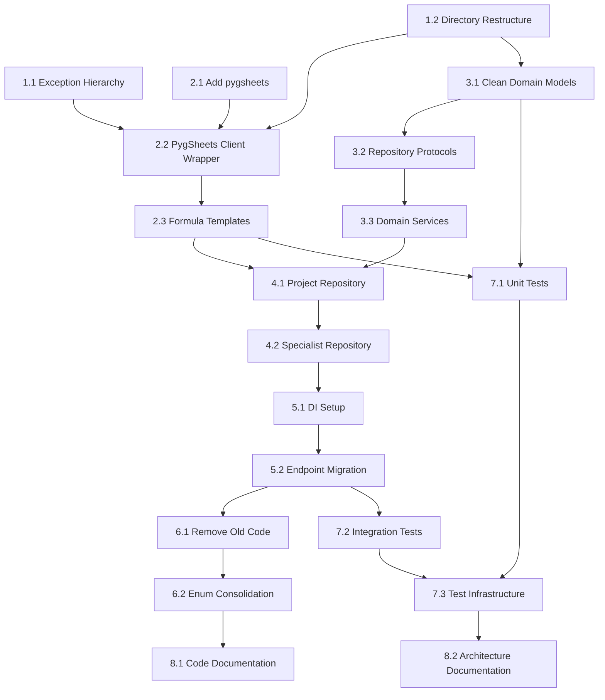

# Improvement Roadmap: FEPTM Server

## Purpose

Sequenced work items to migrate current codebase to target architecture. No timelines or resource allocations.

## Phase 1: Foundation

### 1.1 Exception Hierarchy

**Objective:** Establish custom exception classes for consistent error handling.

**Tasks:**

1. Create `src/feptm/core/exceptions.py`:
   ```python
   class FeptmError(Exception): ...
   class ValidationError(FeptmError): ...
   class NotFoundError(FeptmError): ...
   class GoogleApiError(FeptmError): ...
   class SpreadsheetError(FeptmError): ...
   ```

2. Replace generic `Exception` raises in existing code with specific exceptions

3. Update API endpoints to catch specific exceptions and return appropriate HTTP codes

**Acceptance Criteria:**
- [ ] All custom exceptions defined in `core/exceptions.py`
- [ ] No bare `Exception` raises in codebase (except re-raising)
- [ ] API returns 400 for ValidationError, 404 for NotFoundError, 500 for others

### 1.2 Directory Restructure

**Objective:** Create target directory structure without moving code.

**Tasks:**

1. Create empty directories:
   ```
   src/feptm/
   ├── domain/
   │   ├── models/
   │   └── services/
   ├── adapters/
   │   ├── sheets/
   │   └── google/
   └── interfaces/
       └── api/
           └── v1/
   ```

2. Add `__init__.py` files to all new directories

3. Keep existing code in place until migration phases

**Acceptance Criteria:**
- [ ] All target directories exist
- [ ] Imports work (empty `__init__.py` files present)
- [ ] Existing functionality unaffected

## Phase 2: pygsheets Integration

### 2.1 Add pygsheets Dependency

**Objective:** Replace `google-api-python-client` with `pygsheets`.

**Tasks:**

1. Add `pygsheets>=2.0.0` to `pyproject.toml`
2. Run `uv sync` to install
3. Verify OAuth compatibility with service account or existing credentials

**Acceptance Criteria:**
- [ ] `uv run python -c "import pygsheets"` succeeds
- [ ] Authentication works with existing credentials

### 2.2 PygSheets Client Wrapper

**Objective:** Create thin wrapper isolating domain from pygsheets specifics.

**Tasks:**

1. Create `adapters/sheets/client.py`:
   ```python
   class PygSheetsClient:
       def __init__(self, credentials_file: str) -> None: ...
       def open_spreadsheet(self, spreadsheet_id: str) -> pygsheets.Spreadsheet: ...
       def create_spreadsheet(self, title: str, folder_id: str | None) -> pygsheets.Spreadsheet: ...
       def copy_spreadsheet(self, source_id: str, title: str, folder_id: str | None) -> pygsheets.Spreadsheet: ...
       def get_cell_formula(self, worksheet: Worksheet, addr: str) -> str | None: ...
       def set_cell_formula(self, worksheet: Worksheet, addr: str, formula: str) -> None: ...
       def copy_range_with_formulas(self, worksheet: Worksheet, source: str, dest: str) -> None: ...
       def batch_update_values(self, worksheet: Worksheet, updates: List[tuple[str, Any]]) -> None: ...
   ```

2. Create `adapters/google/auth.py`:
   - `authorize_pygsheets(credentials_file, token_file)` function
   - Support both service account and OAuth flows

3. Create `adapters/google/drive_client.py`:
   - `GoogleDriveClient` using pygsheets internal drive client
   - `create_folder(name, parent_id)` method
   - `move_file(file_id, folder_id)` method
   - `delete_file(file_id)` method

**Acceptance Criteria:**
- [ ] PygSheetsClient wraps all required pygsheets operations
- [ ] Domain layer does not import pygsheets directly
- [ ] Integration test verifies spreadsheet open/create/copy

### 2.3 Formula Templates

**Objective:** Create reusable formula template system.

**Tasks:**

1. Create `adapters/sheets/formula_templates.py`:
   ```python
   @dataclass(frozen=True)
   class FormulaTemplate:
       template: str
       def render(self, **substitutions: str) -> str: ...
   
   IMPORT_TIMESHEET = FormulaTemplate('=IMPORTRANGE("{spreadsheet_id}", "timesheet!A:E")')
   CALCULATE_HOURS = FormulaTemplate('=SUMIF(...)')
   GROSS_TOTAL = FormulaTemplate('=$D{row}*$E{row}')
   # ... other formulas
   ```

2. Migrate hardcoded formulas from `ConfigService` to templates

3. Update formula usage in services to use `FormulaTemplate.render()`

**Acceptance Criteria:**
- [ ] All formulas defined as `FormulaTemplate` instances
- [ ] Unit tests for template substitution
- [ ] No raw formula strings in business logic

## Phase 3: Domain Layer

### 3.1 Clean Domain Models

**Objective:** Create domain models without infrastructure concerns.

**Tasks:**

1. Create `domain/models/specialist.py`:
   ```python
   @dataclass(frozen=True)
   class Rate:
       internal: Decimal
       external: Decimal
   
   @dataclass
   class Specialist:
       name: str
       role: str
       rate: Rate
       joined_date: date
   ```

2. Create `domain/models/project.py`:
   ```python
   @dataclass
   class Project:
       name: str
       created: datetime
       team: List[Specialist]
   ```

3. Create `domain/models/period.py`:
   ```python
   @dataclass
   class PaymentPeriod:
       name: str
       start_date: date
       end_date: date
   ```

**Acceptance Criteria:**
- [ ] No Google IDs in domain models
- [ ] No URL computation in domain models
- [ ] Validation in `__post_init__` methods
- [ ] Unit tests for validation logic

### 3.2 Repository Protocols

**Objective:** Define repository interfaces for domain services.

**Tasks:**

1. Create `domain/services/protocols.py`:
   ```python
   class ProjectRepository(Protocol):
       def create(self, project: Project) -> str: ...
       def get_by_id(self, project_id: str) -> Project: ...
       def save(self, project_id: str, project: Project) -> None: ...
   
   class SpecialistRepository(Protocol):
       def create_timesheet(self, specialist: Specialist, project_id: str) -> str: ...
       def get_by_project(self, project_id: str) -> List[Specialist]: ...
   ```

**Acceptance Criteria:**
- [ ] Protocols use domain types only
- [ ] No infrastructure types in signatures

### 3.3 Domain Services

**Objective:** Implement domain logic with injected repositories.

**Tasks:**

1. Create `domain/services/project_service.py`:
   - `ProjectService.__init__(repository: ProjectRepository)`
   - `create_project(name: str) -> tuple[str, Project]`
   - `get_project(project_id: str) -> Project`

2. Create `domain/services/specialist_service.py`:
   - `SpecialistService.__init__(repository: SpecialistRepository)`
   - `add_to_project(project_id: str, specialist: Specialist) -> str`
   - `get_project_team(project_id: str) -> List[Specialist]`

3. Create `domain/services/period_service.py`:
   - `PeriodService.__init__(repository: PeriodRepository)`
   - `close_period(project_id: str, period: PaymentPeriod) -> None`

**Acceptance Criteria:**
- [ ] Services receive repositories via constructor
- [ ] No direct Google API calls in services
- [ ] Unit tests with in-memory repository mocks

## Phase 4: Repository Implementations

### 4.1 Project Repository

**Objective:** Implement ProjectRepository using pygsheets.

**Tasks:**

1. Create `adapters/sheets/project_repository.py`:
   ```python
   class SpreadsheetProjectRepository(ProjectRepository):
       def __init__(self, client: PygSheetsClient, template_id: str, folder_id: str): ...
       def create(self, project: Project) -> str: ...
       def get_by_id(self, project_id: str) -> Project: ...
       def save(self, project_id: str, project: Project) -> None: ...
   ```

2. Implement spreadsheet operations:
   - Copy template using `client.copy_spreadsheet()`
   - Fill project info using `worksheet.update_value()`
   - Read project data using `worksheet.get_values()`

3. Create `adapters/sheets/mappers.py`:
   - `project_to_row(project: Project) -> List[List]`
   - `row_to_project(data: List[List], project_id: str) -> Project`

**Acceptance Criteria:**
- [ ] Repository implements `ProjectRepository` protocol
- [ ] Uses `PygSheetsClient` (not pygsheets directly)
- [ ] Unit tests with mocked client

### 4.2 Specialist Repository

**Objective:** Implement SpecialistRepository using pygsheets.

**Tasks:**

1. Create `adapters/sheets/specialist_repository.py`:
   ```python
   class SpreadsheetSpecialistRepository(SpecialistRepository):
       def __init__(self, client: PygSheetsClient, template_id: str): ...
       def create_timesheet(self, specialist: Specialist, project_id: str) -> str: ...
       def get_by_project(self, project_id: str) -> List[Specialist]: ...
       def update_team_sheet(self, project_id: str, specialist: Specialist, timesheet_id: str) -> None: ...
   ```

2. Implement timesheet creation:
   - Copy template using `client.copy_spreadsheet()`
   - Fill specialist info
   - Link to project via Team sheet

3. Implement formula insertion using `FormulaTemplate`:
   - IMPORTRANGE for report tabs
   - Calculation formulas for Current Period sheet
   - Use `client.copy_range_with_formulas()` for row stretching

4. Add mappers:
   - `specialist_to_row(specialist: Specialist) -> List`
   - `row_to_specialist(row: List) -> Specialist`

**Acceptance Criteria:**
- [ ] Repository implements `SpecialistRepository` protocol
- [ ] Formulas inserted via `FormulaTemplate.render()`
- [ ] Cell stretching uses `copy_range_with_formulas()`
- [ ] Unit tests with mocked client

## Phase 5: Interface Layer

### 5.1 Dependency Injection Setup

**Objective:** Configure DI for API endpoints.

**Tasks:**

1. Create `interfaces/api/dependencies.py`:
   ```python
   def get_sheets_client() -> GoogleSheetsClient:
       ...
   
   def get_unit_of_work(client: GoogleSheetsClient = Depends(get_sheets_client)) -> UnitOfWork:
       ...
   
   def get_project_repository(uow: UnitOfWork = Depends(get_unit_of_work)) -> ProjectRepository:
       ...
   
   def get_project_service(repo: ProjectRepository = Depends(get_project_repository)) -> ProjectService:
       ...
   ```

2. Create lifespan handler for service initialization

**Acceptance Criteria:**
- [ ] All dependencies resolved via FastAPI `Depends`
- [ ] No global service instantiation in endpoints
- [ ] Can override dependencies in tests

### 5.2 Endpoint Migration

**Objective:** Update endpoints to use new services.

**Tasks:**

1. Update `interfaces/api/v1/projects.py`:
   - Replace `TimesheetProjectService` with `ProjectService`
   - Use injected service via `Depends`
   - Map domain models to response DTOs

2. Create `interfaces/api/v1/specialists.py`:
   - Add specialist management endpoints
   - Use `SpecialistService`

3. Create `interfaces/api/v1/periods.py`:
   - Add period close endpoint
   - Use `PeriodService`

**Acceptance Criteria:**
- [ ] All endpoints use injected services
- [ ] Response models separate from domain models
- [ ] Integration tests pass

## Phase 6: Legacy Cleanup

### 6.1 Remove Old Code

**Objective:** Delete deprecated modules after migration.

**Tasks:**

1. Remove `services/google_sheets_service.py` (functionality moved to adapters/sheets/)

2. Remove `timesheets/project_service.py` (functionality split into domain + adapters)

3. Remove `timesheets/specialist_service.py` (functionality split into domain + adapters)

4. Remove `models/context.py` (no longer needed)

5. Update `models/` to re-export from `domain/models/`

6. Move `api/` contents to `interfaces/api/`

7. Remove `google-api-python-client`, `google-auth`, `google-auth-oauthlib` from dependencies

**Acceptance Criteria:**
- [ ] No deprecated modules in codebase
- [ ] Only `pygsheets` in dependencies (not raw Google API client)
- [ ] All imports updated
- [ ] All tests pass

### 6.2 Enum Consolidation

**Objective:** Organize enums and constants.

**Tasks:**

1. Move `SheetName`, `ColumnName` enums to `adapters/sheets/constants.py`

2. Move formulas to `adapters/sheets/formula_templates.py` as `FormulaTemplate` instances

3. Move `DateFormat`, `RangeFormat` to `core/constants.py`

4. Remove `timesheets/config_service.py` (ConfigService merged into repository)

**Acceptance Criteria:**
- [ ] Enums organized by layer
- [ ] No `FormulaName` enum (replaced by `FormulaTemplate` constants)
- [ ] No circular imports
- [ ] All usages updated

## Phase 7: Testing

### 7.1 Unit Test Suite

**Objective:** Comprehensive unit tests for new components.

**Tasks:**

1. Create `tests/unit/domain/`:
   - `test_project_model.py` - model validation
   - `test_specialist_model.py` - model validation, rate periods
   - `test_project_service.py` - service logic with mock repository
   - `test_specialist_service.py` - service logic with mock repository

2. Create `tests/unit/adapters/sheets/`:
   - `test_formula_templates.py` - template rendering, substitutions
   - `test_project_repository.py` - repository with mocked PygSheetsClient
   - `test_specialist_repository.py` - repository with mocked PygSheetsClient
   - `test_mappers.py` - domain <-> spreadsheet mapping

3. Create `tests/unit/adapters/google/`:
   - `test_drive_client.py` - folder operations (mocked)

4. Create mock fixtures:
   ```python
   # tests/conftest.py
   @pytest.fixture
   def mock_pygsheets_client() -> MagicMock:
       """Mock PygSheetsClient for unit tests."""
       ...
   
   @pytest.fixture  
   def mock_worksheet() -> MagicMock:
       """Mock pygsheets.Worksheet."""
       ...
   ```

**Acceptance Criteria:**
- [ ] Coverage ≥80% for domain layer
- [ ] Coverage ≥80% for adapters/sheets layer
- [ ] All tests run in <10 seconds (no real API calls)

### 7.2 Integration Test Suite

**Objective:** End-to-end API tests.

**Tasks:**

1. Create `tests/integration/api/`:
   - `test_projects_api.py` - project creation flow
   - `test_specialists_api.py` - specialist addition flow
   - `test_periods_api.py` - period close flow

2. Create test fixtures:
   - Mock Google API responses
   - In-memory repository for fast tests
   - Optional real API tests (skip by default)

**Acceptance Criteria:**
- [ ] All API endpoints have integration tests
- [ ] Tests use mocked Google API by default
- [ ] CI pipeline runs all tests

### 7.3 Test Infrastructure

**Objective:** Improve test tooling.

**Tasks:**

1. Update `tests/conftest.py`:
   - Shared fixtures for domain objects
   - Mock repository factory
   - Mock UnitOfWork factory

2. Configure pytest:
   ```ini
   [pytest]
   asyncio_mode = auto
   markers =
       integration: marks tests as integration tests
       slow: marks tests as slow
   ```

3. Add coverage configuration:
   ```toml
   [tool.coverage.run]
   source = ["src/feptm"]
   branch = true
   omit = ["*/tests/*"]
   
   [tool.coverage.report]
   fail_under = 80
   ```

**Acceptance Criteria:**
- [ ] `uv run pytest` runs all unit tests
- [ ] `uv run pytest -m integration` runs integration tests
- [ ] `uv run pytest --cov` reports coverage

## Phase 8: Documentation

### 8.1 Code Documentation

**Objective:** Document public APIs.

**Tasks:**

1. Add docstrings to all public classes and methods (Google format)

2. Add module-level docstrings explaining purpose

3. Update type hints for complete coverage

**Acceptance Criteria:**
- [ ] All public APIs have docstrings
- [ ] `mypy --strict` passes

### 8.2 Architecture Documentation

**Objective:** Update project documentation.

**Tasks:**

1. Update `README.md`:
   - Architecture overview
   - Getting started guide
   - Development workflow

2. Archive current docs:
   - Move analysis documents to `docs/archive/`
   - Keep only current architecture docs

**Acceptance Criteria:**
- [ ] README reflects new architecture
- [ ] New developers can onboard via docs

## Work Item Dependencies



## Parallel Work Opportunities

| Track A (Infrastructure) | Track B (Domain) |
|--------------------------|------------------|
| 2.1 Add pygsheets | 3.1 Clean Domain Models |
| 2.2 PygSheets Client Wrapper | 3.2 Repository Protocols |
| 2.3 Formula Templates | 3.3 Domain Services |

Track A and Track B can proceed in parallel after Phase 1 completion.

## Rollback Strategy

Each phase is designed to be reversible:

- **Phase 1-2:** New code only, no existing code modified
- **Phase 3-4:** Domain layer parallel to existing code
- **Phase 5:** Endpoints can switch back to old services
- **Phase 6:** Only executed after full validation

**Checkpoint after Phase 5:**
- All new code in place
- Old code still present and functional
- Can run either implementation

## Success Metrics

| Metric | Current | Target |
|--------|---------|--------|
| Test coverage | ~40% | ≥80% |
| Largest file (lines) | 1379 | ≤300 |
| Google IDs in domain | 5 | 0 |
| Custom exceptions | 0 | ≥5 |
| Services with DI | 0 | All |
| mypy errors | Unknown | 0 |

## Out of Scope

- Performance optimization (address after migration)
- New feature development (address after migration)
- CI/CD pipeline changes (parallel effort)
- Production deployment strategy
