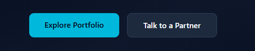
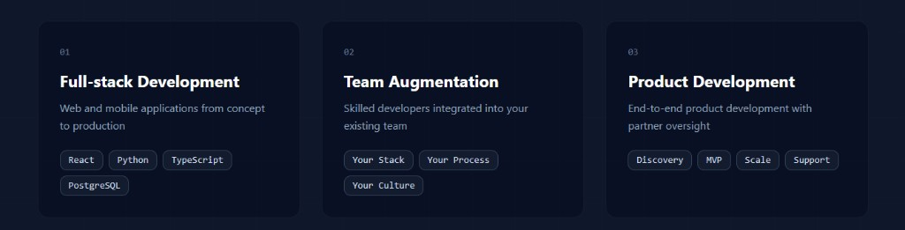
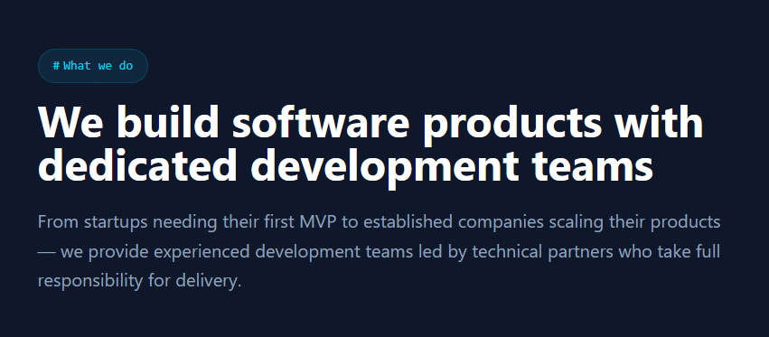
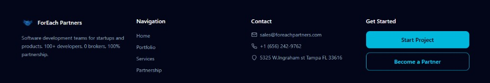

# UI style

Visual reference for the FEPTM panel. Match this look. Do not invent a second palette.

Live source: https://foreachpartners.com/

Snapshot date: 2026-09-01

Copy: background, typography, logo, primary/secondary buttons, cards, section heading, footer.

Do not copy: marketing copy, chat widget, map, extra landing sections.

No input-field screenshot exists. Derive fields, modals, errors, and disabled buttons from the same dark/cyan tokens.

Logo: company-owned; reuse the mark from the header snapshot or the live site.

## Snapshots

### Header

### Primary and secondary buttons

### Cards

### Background and heading

### Footer

