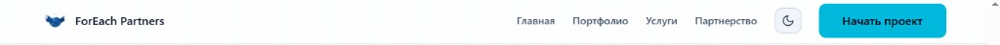
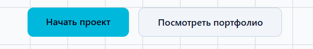
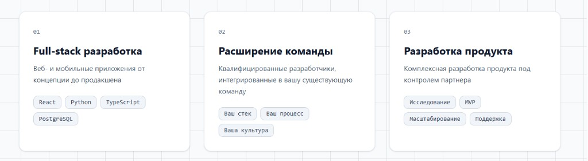
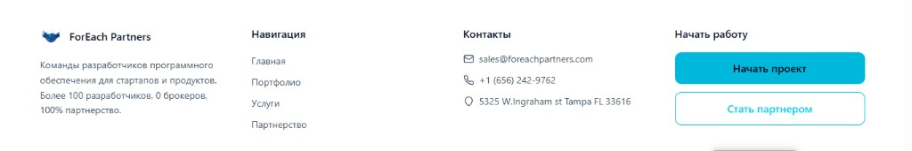

# UI style

Visual reference for the FEPTM panel. Match this look. Two palettes from the live site: dark (default) and light. Do not invent a third palette.

Live source: https://foreachpartners.com/

Dark snapshot date: 2026-09-01

Light snapshot date: 2026-09-02

Copy: background, typography, logo, primary/secondary buttons, cards, section heading, footer. Dark is the default panel theme. Light uses the matching light snapshots. Do not invent a third palette.

Do not copy: marketing copy, chat widget, map, extra landing sections. Do not copy landing nav labels (Home, Portfolio, and so on).

No input-field screenshot exists. Derive fields, modals, errors, and disabled buttons from the same tokens as the active theme (dark/cyan or light/cyan).

The header-light snapshot includes the site theme-toggle control (moon icon, outline button). Use that control shape for the panel theme switch. MUST NOT copy the landing CTA label.

Logo: company-owned; reuse the mark from the header snapshot or the live site.

## Dark snapshots

### Header

### Primary and secondary buttons

### Cards

### Background and heading

### Footer

## Light snapshots

### Header and theme toggle

### Primary and secondary buttons

### Cards

### Background and heading

### Footer

