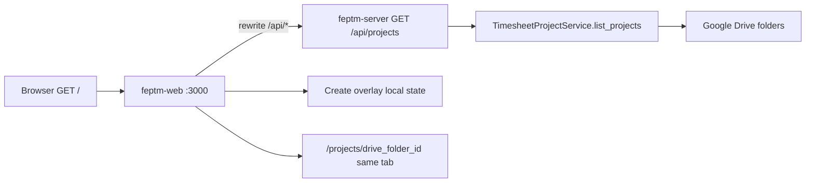

# WF-13: Technical Plan

Implements: FR-PROJECT-001
AR references: AR-LINEAGE-001, AR-LINEAGE-002, AR-WEBARCH-001, AR-REACT-001, AR-WRITING-001, AR-WORKSPACE-001, AR-SECRETS-001
Context: [context.md](context.md)

**Workflow:** WF-13-show-project-list-on-shared (medium ceremony)
**Repos:** web (`feptm-web`), feptm-server (consume only)
**Task:** Show the project list on the shared dashboard URL
**baseline_policy:** `fix_err` — baseline has WARN only (no ERR). Do not remediate existing WARN. Enforce zero new violations in touched files.

## Architecture Overview

GET list already exists (WF-11). This workflow implements the shared-URL UI.

- Shared dashboard URL = Next.js `/` (`feptm-web/src/app/page.tsx`).
- Proxy already in `feptm-web/next.config.ts`: `/api/:path*` to `NEXT_PUBLIC_API_URL` (default `http://localhost:8000`).
- No sign-in. Do not add login or password fields.
- Backend files stay unchanged: `feptm-server/src/feptm/api/v1/projects.py` (`# @req FR-PROJECT-001`), sort in `feptm-server/src/feptm/timesheets/project_service.py`.

## Proto Contracts

No proto. N/A.

## REST API

Spec lives in Pydantic, not OpenAPI files.

| Method | Path | Status | Meaning |
|--------|------|--------|---------|
| GET | `/api/projects` | 200 | `{ "projects": [ { "name", "drive_folder_id" } ] }` |
| GET | `/api/projects` | 200 | `{ "projects": [] }` — empty is success |
| GET | `/api/projects` | 500 | config/Drive failure |

Client MUST call this endpoint once per dashboard mount (TanStack Query one query key). Display names from that response.

UI error copy MUST be exact FR text, not FastAPI `detail`:
`Failed to load the project list. Refresh the page or try again later.`

### OpenAPI Schema Changes

No schema changes.

## Database Schema

No migrations. Drive folders are the list source.

## Implementation Details

### Out of scope

- POST create (FR-CREATE-001): overlay open/close + form chrome only; no create request.
- Theme toggle (FR-THEME-001): first paint stays dark via existing `color-scheme: dark` in `feptm-web/src/app/globals.css`.
- Project card Tables/sync (FR-SHEET-001 / FR-SYNC-*): keep stub `feptm-web/src/app/projects/[projectId]/page.tsx`.

### Dependencies (AR-REACT-001)

Add to `feptm-web/package.json`: `zustand`, `@tanstack/react-query`. QueryClient `retry: 0`. Wrap app in providers (`feptm-web/src/app/layout.tsx`). Named exports except `src/app/**` (allowed default).

No Tailwind in repo. Style via CSS custom properties (AR-WEBARCH-001), not a second palette.

### Feature layout

| File | Role |
|------|------|
| `feptm-web/src/types/project.ts` | `ProjectListItem`, `ProjectListResponse` |
| `feptm-web/src/lib/api/projects.ts` | `fetchProjectList()` → `GET /api/projects`; comment `// @req FR-PROJECT-001` |
| `feptm-web/src/features/projects/useProjectList.ts` | `useQuery` |
| `feptm-web/src/features/projects/projectDashboardStore.ts` | Zustand: overlay open |
| `feptm-web/src/features/projects/ProjectDashboard.tsx` | heading, Create, list states |
| `feptm-web/src/features/projects/ProjectNameList.tsx` | cards; `key={drive_folder_id}` |
| `feptm-web/src/features/projects/CreateProjectOverlay.tsx` | overlay form; pointer-events on dimmer: no list click, no navigation |
| `feptm-web/src/components/AppHeader.tsx` | ForEach Partners logo + chrome |
| `feptm-web/src/components/PrimaryButton.tsx` | Create project |
| `feptm-web/src/app/page.tsx` | compose `ProjectDashboard` only |
| `feptm-web/src/app/projects/new/page.tsx` | `redirect('/')` so create is overlay, not a standalone page |
| `feptm-web/src/app/globals.css` | tokens: surface, radius, button, card, overlay (dark only) |
| `feptm-web/public/` | company logo asset |

### FR copy (MUST match)

- Heading: `FEP Projects Dashboard`
- Button: `Create project` — enabled while loading and on list error
- Empty 200: `no projects` + button
- Loading: visible loading state + button enabled
- Error: exact failure sentence above
- Client-side sort by `name` case-insensitive as defense in depth

### Navigation

`next/link` to `/projects/${encodeURIComponent(drive_folder_id)}` (same tab, no `target=_blank`). Optional `?name=` for later card. Do not implement card UI here.

## Security Considerations

- No auth on dashboard (FR).
- Same-origin `/api/projects` via rewrite; do not put secrets in client.
- Overlay dimmer MUST stop clicks through to list.

## Config Changes

No new keys. Keep `NEXT_PUBLIC_API_URL` in `feptm-web/env.example`. Prefix N/A for web.
