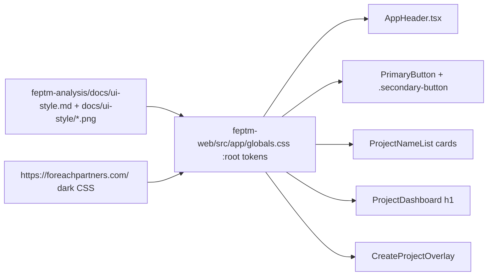

# WF-13: Technical Plan

Implements: FR-PROJECT-001
AR references: AR-WEBARCH-001, AR-REACT-001, AR-LINEAGE-001, AR-LINEAGE-002, AR-WRITING-001, AR-WORKSPACE-001, AR-SECRETS-001
Context: [context.md](context.md)

**Workflow:** WF-13-show-project-list-on-shared (medium ceremony)
**Repos:** web (`feptm-web`); feptm-server unchanged
**Task:** Align dashboard dark theme with FR-PROJECT-001 last acceptance criterion
**baseline_policy:** `fix_err` — baseline has WARN only (no ERR). Do not remediate existing WARN. Enforce zero new violations in touched files.

## Architecture Overview

Visual-only change on the existing shared dashboard. List fetch, overlay behaviour, and backend stay as implemented in plan-001.

Sources of truth (in this order):

1. `feptm-analysis/docs/ui-style.md`
2. Dark snapshots: `docs/ui-style/header.png`, `buttons.png`, `cards.png`, `heading.png` (footer chrome from `footer.png` tokens only)
3. Live dark page `https://foreachpartners.com/` (sampled 2026-09-04): Geist / Geist Mono; cyan-400 primary; slate-950 page; wordmark `ForEach Partners`. Header mark is the vendored PNG in `docs/ui-style/foreach-partners-logo.png`, not a live download.

MUST NOT copy landing nav labels, “Start Project”, hero copy, chat widget, map, extra landing sections.

MUST NOT implement FR-THEME-001 (no theme toggle, no light tokens block required). First paint stays dark. `html` MUST force dark independent of OS (`color-scheme: dark`; do not read `prefers-color-scheme`).

## Proto Contracts

No proto. N/A.

## REST API

No API changes. Client still uses `GET /api/projects/` via `feptm-web/src/lib/api/projects.ts`.

### OpenAPI Schema Changes

No schema changes.

## Database Schema

No migrations.

## Implementation Details

### Gap vs current `feptm-web`

| Surface | Now | MUST become |
|---------|-----|-------------|
| Palette | Invented teal `#07161a` / `#22d3c5` in `src/app/globals.css` | Navy/slate + cyan from snapshots + live CSS (see token table) |
| Font | `--font: Arial` | Geist Sans + Geist Mono via `next/font` in `src/app/layout.tsx` |
| Header | Solid `--surface` bar + fake text SVG | Transparent/page-bg bar; real mark + white wordmark (`header.png`) |
| Logo | Invented `public/shaking-hands.svg` + CSS mask | Copy `feptm-analysis/docs/ui-style/foreach-partners-logo.png` to `feptm-web/public/foreach-partners-logo.png`. `AppHeader` MUST use `/foreach-partners-logo.png` as `` (32px). MUST NOT fetch foreachpartners.com, crop `header.png`, invent SVG, or apply `currentColor` / CSS mask. Delete `public/shaking-hands.svg` |
| Primary button | Pill `border-radius: 999px`; text `#041214` hardcoded | Rounded rect like `buttons.png` / `header.png`; text `var(--on-accent)` |
| Secondary | Cyan border + cyan text | Ghost from `buttons.png`: transparent, 1px faint border, white text. One pair only (AR-WEBARCH-001). Do not add a third cyan-outline style from footer CTAs |
| List | Full-width stacked rows, heavy shadow | Card grid like `cards.png`: raised navy card, thin border, generous padding, no heavy drop-shadow |
| Heading | `2rem` / 700 | Display scale like `heading.png` (large white sans, tight leading). Copy stays `FEP Projects Dashboard`. Do not paste “# What we do” or hero paragraph |
| Body | Flat fill | Dark navy; optional subtle grid from `buttons.png` as CSS (tokenized), not a bitmap copy of the landing |

Hardcoded palette leftovers to remove:

- `src/app/globals.css` `.primary-button { color: #041214; }`
- Invented `public/shaking-hands.svg` and `.app-header__mark` CSS mask
- Any future `style={{ color: ... }}` / inline hex

### Token layer (AR-WEBARCH-001)

Single stylesheet: `feptm-web/src/app/globals.css`. `:root` only (dark default). Components MUST use `var(--*)` for color, font, radius, space, shadow.

Implementer MUST sample hex/oklch from the PNGs (eyedrop `header.png` bg, cyan CTA, card fill, muted text) and confirm against live CSS. Live sample 2026-09-04 (do not invent a third palette):

| Token | Role | Live / snapshot cue |
|-------|------|---------------------|
| `--background` | Page | `oklch(12.9% .042 264.695)` (slate-950) / heading.png navy |
| `--foreground` | Primary text | white / `oklch(98.5% 0 0)` |
| `--muted` | Secondary text | slate-400 |
| `--accent` | Primary fill | cyan-400 `oklch(78.9% .154 211.53)` |
| `--on-accent` | Text on primary | near `--background` (not a new hue) |
| `--surface` | Header/card | slightly above page (slate-900) |
| `--border` | Card/header hairline | slate-700/800 |
| `--radius` | Buttons + cards | ~0.625rem–1rem; NOT 999px |
| `--font-sans` | UI + heading | Geist |
| `--font-mono` | Optional labels | Geist Mono |
| `--error` | List error | keep semantic red; derive from same dark theme, not a new brand |

Overlay field/disabled: no input snapshot. Derive from the same tokens (`ui-style.md`).

### Fonts

`feptm-web/src/app/layout.tsx`: load Geist + Geist Mono with `next/font/google` (or `geist` package). Apply class on `<html>` / `<body>`. Set `--font-sans` / `--font-mono` from the font CSS variables. Fallback: `system-ui, sans-serif` — not Arial as the designed face.

### Components / CSS

| File | Change |
|------|--------|
| `feptm-web/src/app/globals.css` | Replace palette; button radius/padding; card grid; heading scale; header layout; overlay uses tokens only |
| `feptm-web/src/app/layout.tsx` | Wire fonts; keep `lang="en"` |
| `feptm-web/src/components/AppHeader.tsx` | `` + wordmark `ForEach Partners`; no nav, no “Start Project”, no theme button |
| `feptm-web/src/components/PrimaryButton.tsx` | Keep class `primary-button`; no local colors |
| `feptm-web/src/features/projects/ProjectDashboard.tsx` | Heading class only; FR copy unchanged |
| `feptm-web/src/features/projects/ProjectNameList.tsx` | Card grid classes; still `Link` same tab |
| `feptm-web/src/features/projects/CreateProjectOverlay.tsx` | Cancel stays `.secondary-button` (buttons.png ghost) |
| `feptm-web/public/` | Copy `docs/ui-style/foreach-partners-logo.png`; delete `shaking-hands.svg` |

Optional chrome: compact footer using footer.png **tokens** (muted line, e.g. `© 2026 ForEach Partners`) without nav/contact/CTA columns.

Stub `src/app/projects/[projectId]/page.tsx` inherits body tokens. Do not build the project card UI here.

### Out of scope

- Light theme CSS and toggle (FR-THEME-001)
- POST create (FR-CREATE-001)
- feptm-server
- Adding Tailwind (repo has no Tailwind; tokens stay CSS variables)

## Security Considerations

- No secrets. Logo/font files are public brand assets.
- Do not hotlink production CSS or `/shaking-hands.svg` from foreachpartners.com at runtime; vendor fonts through Next. Logo file is already in `docs/ui-style/foreach-partners-logo.png`.

## Config Changes

No new env keys. Prefix N/A for web.
