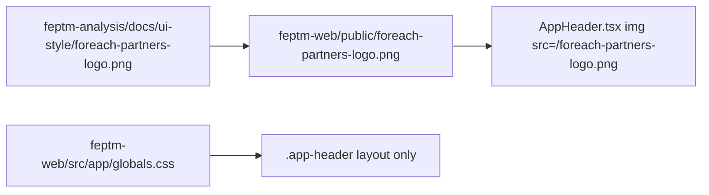

# WF-13: Technical Plan

Implements: FR-PROJECT-001
AR references: AR-WEBARCH-001, AR-REACT-001, AR-LINEAGE-001, AR-LINEAGE-002, AR-WRITING-001, AR-WORKSPACE-001, AR-SECRETS-001
Context: [context.md](context.md)

**Workflow:** WF-13-show-project-list-on-shared (medium ceremony)
**Repos:** web (`feptm-web`); feptm-server unchanged
**Task:** Replace the invented header mark with the vendored ForEach Partners PNG. Keep the rest of the dark dashboard from cycle 2.
**baseline_policy:** `fix_err` — baseline has WARN only (no ERR). Do not remediate existing WARN. Enforce zero new violations in touched files.

## Architecture Overview

Visual-only header-mark fix on the existing shared dashboard at `/`. List fetch, overlay behaviour, tokens, fonts, buttons, cards, and backend stay as implemented in plan-001 + plan-002.

Sources of truth for this cycle:

1. FR-PROJECT-001 last acceptance criterion (ForEach Partners header logo)
2. `feptm-analysis/docs/ui-style.md` Logo paragraph
3. File `feptm-analysis/docs/ui-style/foreach-partners-logo.png` (already in repo)

MUST NOT:

- Download `https://foreachpartners.com/shaking-hands.svg` (live path returned HTML, not SVG)
- Crop `docs/ui-style/header.png`
- Redraw, recolor, or tokenize the PNG (`currentColor`, CSS `mask`, `background` fill)
- Implement FR-THEME-001
- Change feptm-server
- Copy landing nav, “Start Project”, marketing copy, chat widget

## Proto Contracts

No proto. N/A.

## REST API

No API changes. Client still uses `GET /api/projects/` via `feptm-web/src/lib/api/projects.ts`.

### OpenAPI Schema Changes

No schema changes.

## Database Schema

No migrations.

## Implementation Details

### Gap vs current `feptm-web`

| Surface | Now | MUST become |
|---------|-----|-------------|
| Header mark | `span.app-header__mark` + CSS `mask: url('/shaking-hands.svg')` + `currentColor` / `--accent` | Binary copy of `feptm-analysis/docs/ui-style/foreach-partners-logo.png` → `feptm-web/public/foreach-partners-logo.png`. `AppHeader` renders `` plus wordmark `ForEach Partners` |
| Invented asset | `feptm-web/public/shaking-hands.svg` | Delete the file |
| CSS mask | `.app-header__mark` in `feptm-web/src/app/globals.css` | Delete the rule. Size the `` with a class (e.g. `.app-header__logo`: 32×32, `flex-shrink: 0`, `object-fit: contain`). No mask, no `currentColor` |
| Dark dashboard | Cycle 2 tokens, Geist, buttons, cards, heading, overlay | Unchanged |

Binary copy MUST be byte-identical to the analysis-repo PNG. Do not open it in an editor and re-export.

### Components / CSS

| File | Change |
|------|--------|
| `feptm-web/public/foreach-partners-logo.png` | Copy from `feptm-analysis/docs/ui-style/foreach-partners-logo.png` |
| `feptm-web/public/shaking-hands.svg` | Delete |
| `feptm-web/src/components/AppHeader.tsx` | Replace the `span.app-header__mark` with the `` above; keep wordmark `ForEach Partners`; no nav, no “Start Project”, no theme button |
| `feptm-web/src/app/globals.css` | Remove `.app-header__mark`. Add img sizing class. Leave `:root` tokens, buttons, cards, heading, overlay as in cycle 2 |

Do not edit `layout.tsx`, `ProjectDashboard.tsx`, `ProjectNameList.tsx`, `PrimaryButton.tsx`, `CreateProjectOverlay.tsx`, or any feptm-server file unless a compile error is caused by this header change (not expected).

`@req` stays on `feptm-web/src/lib/api/projects.ts` (contract boundary). AppHeader is presentational; do not add a new `@req` there.

### Out of scope

- Light theme CSS and toggle (FR-THEME-001)
- POST create (FR-CREATE-001)
- feptm-server
- Tailwind
- Re-sampling tokens or restyling buttons/cards

## Security Considerations

- No secrets. Logo is a public brand asset already stored in `feptm-analysis/docs/ui-style/foreach-partners-logo.png`.
- Do not hotlink foreachpartners.com at runtime.

## Config Changes

No new env keys. Prefix N/A for web.
