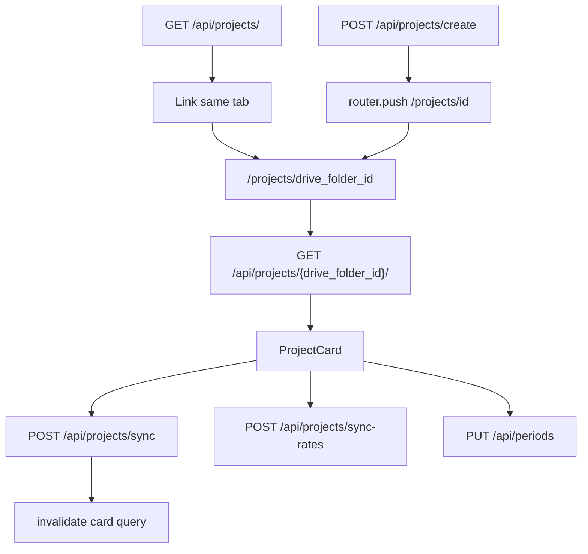

# WF-14: Technical Plan

Implements: FR-PROJECT-001, FR-CREATE-001, FR-SHEET-001, FR-SYNC-001, FR-SYNC-RATES-001, FR-PAYMENT-001
AR references: AR-WEBARCH-001, AR-REACT-001, AR-NEXTJS-001, AR-API-001, AR-HTML-001, AR-TYPESCRIPT-001, AR-FALLBACK-001, AR-LINEAGE-001, AR-LINEAGE-002, AR-WRITING-001, AR-WORKSPACE-001, AR-SECRETS-001
Context: [context.md](context.md)

**Workflow:** WF-14-project-card-it-opens-same (large ceremony)
**Repos:** web (`feptm-web`); feptm-server unchanged
**Task:** Create a project card
**baseline_policy:** `fix_err` — baseline has 0 ERR, 1 WARN (`.gitignore` missing `.DS_Store`). Do not remediate the existing WARN. Enforce zero new violations in touched files.

## Architecture Overview

The project card is the same-tab App Router route `/projects/{drive_folder_id}`. The dashboard list already navigates there with Next.js `Link` in `feptm-web/src/features/projects/ProjectNameList.tsx`. Replace the stub in `feptm-web/src/app/projects/[projectId]/page.tsx` with feature composition.

The create overlay already sits on the dashboard. Submit in `feptm-web/src/features/projects/CreateProjectOverlay.tsx` is a no-op. Success MUST close the overlay and `router.push` to the same card URL.

Backend contracts exist (WF-12). The web client MUST call them. Do not change feptm-server.

MUST NOT:

- Open the card with `window.open` or a new tab
- Change feptm-server
- Implement FR-THEME-001
- Copy marketing landing copy or the chat widget

## Proto Contracts

No proto. N/A.

## REST API

Mirror existing FastAPI contracts. No new endpoints.

- `POST /api/projects/create` — body `{ project_name }`; 200 `ProjectMetaResponse`. `drive_folder_id` is required for navigation. The response has no `name`; use the trimmed form value.
- `GET /api/projects/{drive_folder_id}/` — trailing slash MUST be present (avoid 307).
- `POST /api/projects/sync` — `{ project_id }` where `project_id` is `ProjectCardResponse.project_id` (info spreadsheet id, not folder id).
- `POST /api/projects/sync-rates` — `{ project_id }`.
- `PUT /api/periods` — `{ project_id, period_name }`; HTTP 409 means the period is already closed.

Spec source: FastAPI `/openapi.json`. No OpenAPI YAML file in the repo.

### OpenAPI Schema Changes

No schema changes.

Client types MUST match server models in `feptm-server/src/feptm/models/project.py` and `feptm-server/src/feptm/models/payment_period.py`:

- `ProjectCardResponse`: `name`, `drive_folder_id`, `project_id`, `tables.{project_info|general_expenses|payment_distribution}.{label,spreadsheet_id,url}`, `timesheets[]{name,spreadsheet_id,url}`
- `ProjectSyncResponse.specialists_created`
- `ProjectSyncRatesResponse.specialists_updated`
- `ClosePeriodResponse.period_name`

## Database Schema

No migrations.

## Implementation Details

### 1. API client — `feptm-web/src/lib/api/projects.ts`, `feptm-web/src/lib/api/errors.ts`

AR-API-001: keep every `fetch` in `src/lib/api/`. Add `ApiClientError` with `status` and kind `network` | `api` | `invalid_json`. Set `Accept: application/json` on every request and `Content-Type: application/json` on requests with a body. React Query `retry: 0`.

New exported functions. Place `// @req` on the line directly above each export:

- `createProject` — FR-CREATE-001
- `fetchProjectCard` — FR-PROJECT-001, FR-CREATE-001, FR-SHEET-001
- `syncProjectTeam` — FR-SYNC-001
- `syncProjectRates` — FR-SYNC-RATES-001
- `closeProjectPeriod` — FR-PAYMENT-001

Components MUST NOT call `fetch` directly.

Any create failure (network, 4xx/5xx, timeout, duplicate name) MUST surface one UI string: `Failed to create the project. Try again later.` The server currently returns 500 for create failures, including name collisions. The web client MUST NOT branch on create status codes.

Keep `fetchProjectList` user-facing copy unchanged. When editing `projects.ts`, route that function through `ApiClientError` without changing the list error text.

Extend types in `feptm-web/src/types/project.ts`. Reuse `ProjectMeta` and `CreateProjectRequest`. DO NOT invent spreadsheet URLs (AR-FALLBACK-001). DO NOT render a link without a `url`.

### 2. Create overlay — FR-CREATE-001

Complete `feptm-web/src/features/projects/CreateProjectOverlay.tsx` and add `feptm-web/src/features/projects/useCreateProject.ts`.

- Disable Create while the name is empty or whitespace-only. Do not send a request.
- While creating: show `Creating...`. Disable Create and Cancel. Backdrop and Escape MUST NOT close the overlay. A repeated submit MUST NOT send a second request (`isPending`).
- On error: keep the overlay open, show the create error text, enable Create and Cancel again.
- Cancel while not busy: close the overlay. The new project MUST NOT appear in the list.
- Success: `closeCreateOverlay()`, `queryClient.invalidateQueries` for `['projects']`, `router.push` to `/projects/{drive_folder_id}?name={trimmedName}` in the same tab.
- A click on the dimmed dashboard MUST NOT create a project and MUST NOT open a card.

### 3. Project card page — FR-PROJECT-001

`feptm-web/src/app/projects/[projectId]/page.tsx` composes named feature `ProjectCard` from `feptm-web/src/features/projects/ProjectCard.tsx`. Render `AppHeader` (logo + `ForEach Partners`), `<main>`, and footer the same way as `feptm-web/src/features/projects/ProjectDashboard.tsx`. `AppHeader` is not in the root layout. The card page MUST render it.

Card structure:

- Top left: `Back to project list` — `<Link href="/">` in the same tab. While a command is in progress, render a disabled control instead of a navigable link.
- `h1`: `Project {name}`. Use GET card `name`. Use the `name` query param only as a loading hint.
- Command row: `Update team` (primary), `Update rates` (secondary), `Close period` (secondary).
- Tables block.
- Status / result in an ARIA live region (AR-HTML-001).

GET loading: show a visible status. GET failure: `Failed to load the project card. Refresh the page or try again later.` Back stays enabled (not a command lock). Disable command buttons until `project_id` is present.

### 4. Tables — FR-SHEET-001

Always show the three project-sheet links from `tables.*` using the server `label`. Specialist timesheets: one link per `timesheets[]` item; the label is `name` (Drive file name). The server already sorts timesheets. The client MUST NOT re-sort and MUST NOT invent extra links.

Use `<a href={url} target="_blank" rel="noopener noreferrer">`. The card stays in the previous tab.

After a successful Update team: invalidate the card query. New timesheet links come only from the refetched GET. On Update team failure: do not refetch; keep already shown links from the current cache.

### 5. Commands — FR-SYNC-001, FR-SYNC-RATES-001

One command lock on the card. While Update team, Update rates, or Close period is in progress:

- Disable Update team, Update rates, Close period, and Back
- A repeated click MUST NOT send a second request
- Status: `Updating team...` / `Updating rates...`

Success (card stays open):

- team: `Timesheets created: {specialists_created}.` including 0
- rates: `Rates updated: {specialists_updated}.` including 0

Failure and network timeout (card stays open):

- `Failed to update the team. Try again later.`
- `Failed to update rates. Try again later.`

Enable command buttons and Back again. DO NOT show per-row Team errors on the card.

### 6. Close period modal — FR-PAYMENT-001

Modal over the card. Reuse the create-overlay token pattern (`--overlay`, `--surface`) in `feptm-web/src/app/globals.css`. Not a new page and not a new tab.

- Backdrop click MUST NOT close the period, MUST NOT open Sheets, and MUST NOT navigate to the list. The card under the modal is not clickable (`pointer-events: none` or `inert`).
- Period name field. Warning text: `Important! All unclosed hours, rates, and dates will be fixed. After that they can be changed only by hand.`
- Confirm is primary. Cancel is secondary.
- Confirm is disabled while Period name is empty or whitespace-only. Do not send a request.
- Cancel before success: close the modal. The period is not closed.
- While closing: `Closing period...`. The modal cannot be closed. Confirm, Cancel, Update team, Update rates, Close period, and Back are disabled.
- Success: keep the modal open. Show `Period closed: {period_name}.` from the response. Disable Confirm. Enable Cancel: it closes the modal; the period stays closed. Cancel does not undo closure.
- Failure and network timeout: keep the modal open. Show `Failed to close the period. Try again later.` Enable Confirm and Cancel.
- HTTP 409: keep the modal open. Show `This period is already closed.` Enable Confirm and Cancel.

### 7. CSS — `feptm-web/src/app/globals.css`

Consume `:root` tokens only (AR-WEBARCH-001). Add classes for the card, command row, Tables, Back, status, and close modal. Reuse `.create-overlay*` where the layout matches. DO NOT add a third palette. DO NOT add Tailwind. DO NOT hardcode a local palette.

### 8. State — AR-REACT-001

- Zustand: create-overlay visibility only (`feptm-web/src/features/projects/projectDashboardStore.ts`). Close-period open MAY be local card state.
- TanStack Query: list, card, mutations. `retry: 0`.
- Named exports for feature components. `src/app` is route composition only.
- App Router pages MAY `export default` (AR-REACT exclude for `src/app/**`).

Hooks:

- `feptm-web/src/features/projects/useCreateProject.ts`
- `feptm-web/src/features/projects/useProjectCard.ts`
- `feptm-web/src/features/projects/useProjectCommands.ts`

Components:

- `feptm-web/src/features/projects/ProjectCard.tsx`
- `feptm-web/src/features/projects/ProjectCardTables.tsx`
- `feptm-web/src/features/projects/ClosePeriodModal.tsx`

### Out of scope

- feptm-server, OpenAPI YAML, proto
- FR-THEME-001
- Remediation of the baseline WARN `.DS_Store`
- A new test runner (`feptm-web` has no tests)
- Auth

## Security Considerations

- No secrets. DO NOT log request or response bodies.
- Browser calls stay on same-origin `/api/*` via `feptm-web/next.config.ts` rewrite (`NEXT_PUBLIC_API_URL`).
- Spreadsheet links use `rel="noopener noreferrer"`.
- Trim project name and period name. DO NOT send empty values.

## Config Changes

No new env keys. Prefix N/A for web.
