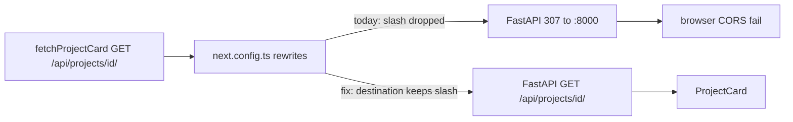

# WF-14: Technical Plan

Implements: FR-PROJECT-001, FR-CREATE-001, FR-SHEET-001, FR-SYNC-001, FR-SYNC-RATES-001, FR-PAYMENT-001
AR references: AR-NEXTJS-001, AR-API-001, AR-LINEAGE-001, AR-LINEAGE-002, AR-WRITING-001, AR-WORKSPACE-001, AR-SECRETS-001
Context: [context.md](context.md)

**Workflow:** WF-14-project-card-it-opens-same (large ceremony)
**Repos:** web (`feptm-web`); feptm-server unchanged
**Task:** Keep the trailing slash on `GET /api/projects/{driveFolderId}/` when Next.js rewrites the request to feptm-server. FastAPI 307 without the slash breaks card load (CORS).
**baseline_policy:** `fix_err` — baseline has 0 ERR, 1 WARN (`.gitignore` missing `.DS_Store`). Do not remediate the existing WARN. Enforce zero new violations in touched files.

## Architecture Overview

Cycle 1 already implemented the same-tab card. `feptm-web/src/lib/api/projects.ts` `fetchProjectCard` already requests same-origin `GET /api/projects/{driveFolderId}/` (slash present).

The proxy in `feptm-web/next.config.ts` still drops that slash. Browser request matches the catch-all `source: '/api/:path*'`. Next.js `:path*` does not keep the trailing slash, so the upstream URL is `GET {apiOrigin}/api/projects/{driveFolderId}` (no slash).

FastAPI handler is `GET /api/projects/{drive_folder_id}/` in `feptm-server/src/feptm/api/v1/projects.py` (`@router.get("/{drive_folder_id}/")`, router prefix `/projects`, app prefix `/api`). Default slash redirect issues HTTP 307 to `{apiOrigin}/api/projects/{driveFolderId}/`. feptm-server has no CORS middleware. The browser follows the 307 to `:8000` and the card GET fails.

WF-13 already fixed the list the same way: explicit `/api/projects` and `/api/projects/` rules that set destination `/api/projects/`. Apply that pattern to the card path. Touch only `feptm-web/next.config.ts`.



MUST NOT:

- Change feptm-server (no `redirect_slashes`, no CORS, no route change)
- Edit `feptm-web/src/lib/api/projects.ts` or any UI file
- Change user-facing copy
- Add a no-slash `/api/projects/:driveFolderId` rule whose destination appends `/` — that also matches `POST /api/projects/create`, `/sync`, `/sync-rates`

## Proto Contracts

No proto. N/A.

## REST API

No new endpoints. No server change.

Client path (already correct in `feptm-web/src/lib/api/projects.ts`):

- `GET /api/projects/{drive_folder_id}/` — trailing slash MUST reach FastAPI. 200 `ProjectCardResponse`.

Proxy MUST send that path to `{NEXT_PUBLIC_API_URL}/api/projects/{drive_folder_id}/` (origin without a trailing slash, path with a trailing slash). Same-origin to the browser. No 307 to `:8000`.

Unchanged (keep matching the current catch-all, no extra slash):

- `GET /api/projects/` — existing explicit list rules
- `POST /api/projects/create`
- `POST /api/projects/sync`
- `POST /api/projects/sync-rates`
- `PUT /api/periods`

Spec source: FastAPI `/openapi.json`. No OpenAPI YAML file in the repo.

### OpenAPI Schema Changes

No schema changes.

## Database Schema

No migrations.

## Implementation Details

File: `feptm-web/next.config.ts` only.

Keep:

- `resolveApiOrigin()` — strip a trailing slash from `NEXT_PUBLIC_API_URL` only
- `skipTrailingSlashRedirect: true`
- `reactStrictMode: true`
- Existing list rules (`/api/projects` and `/api/projects/` → `${apiOrigin}/api/projects/`)
- Catch-all `/api/:path*` → `${apiOrigin}/api/:path*` as the last rule

Add one rule after the list rules and before the catch-all:

```ts
{
  source: '/api/projects/:driveFolderId/',
  destination: `${apiOrigin}/api/projects/:driveFolderId/`,
},
```

Rule order MUST be:

1. `/api/projects` → `${apiOrigin}/api/projects/`
2. `/api/projects/` → `${apiOrigin}/api/projects/`
3. `/api/projects/:driveFolderId/` → `${apiOrigin}/api/projects/:driveFolderId/`  (new)
4. `/api/:path*` → `${apiOrigin}/api/:path*`

Restart the Next.js process after the edit. `next.config.ts` is not hot-reloaded.

### Out of scope

- feptm-server, OpenAPI YAML, proto
- UI copy, CSS, React components, API client
- FR-THEME-001
- Remediation of the baseline WARN `.DS_Store`
- A new test runner
- Auth

## Security Considerations

- Browser calls stay same-origin `/api/*` (AR-NEXTJS-001, AR-API-001). The rewrite destination still comes from `NEXT_PUBLIC_API_URL`, not a hardcoded host.
- A 307 to `:8000` exposes the backend origin to the browser. The slash-preserving rewrite MUST prevent that redirect.
- No secrets. Do not log request or response bodies.

## Config Changes

No new env keys. Prefix N/A for web. Keep `NEXT_PUBLIC_API_URL` as the rewrite origin.
