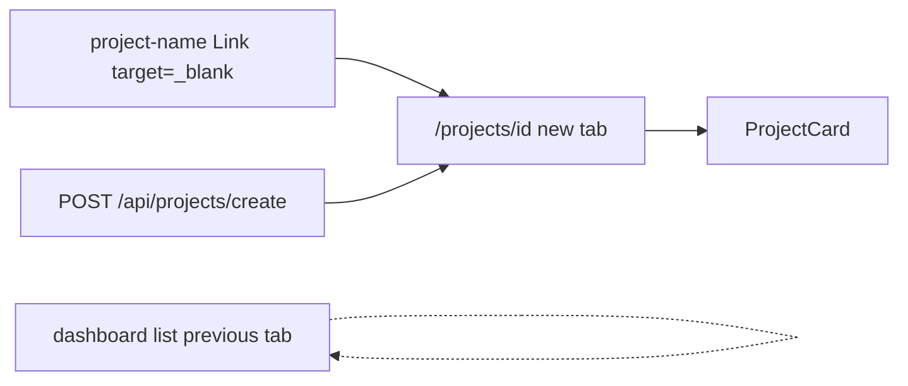

# WF-14: Technical Plan

Implements: FR-PROJECT-001, FR-CREATE-001, FR-SHEET-001, FR-SYNC-001, FR-SYNC-RATES-001, FR-PAYMENT-001
AR references: AR-WEBARCH-001, AR-REACT-001, AR-NEXTJS-001, AR-HTML-001, AR-TYPESCRIPT-001, AR-LINEAGE-001, AR-LINEAGE-002, AR-WRITING-001, AR-WORKSPACE-001, AR-SECRETS-001
Context: [context.md](context.md)

**Workflow:** WF-14-project-card-it-opens-same (large ceremony)
**Repos:** web (`feptm-web`); feptm-server unchanged
**Task:** Open the project card in a new browser tab on a project-name click and after a successful create; keep the dashboard list in the previous tab. Color the heading word `Project` with the Update team primary token. Keep the project name on the heading.png token. Style Update rates and Close period in the command row as primary buttons, same as Update team. Keep Close period modal Confirm primary and Cancel secondary.
**baseline_policy:** `fix_err` — baseline has 0 ERR, 1 WARN (`.gitignore` missing `.DS_Store`). Do not remediate the existing WARN. Enforce zero new violations in touched files.

## Architecture Overview

Cycles 1–2 already ship the card at `/projects/{drive_folder_id}` and the slash-preserving rewrite. This cycle changes navigation and card chrome only.

Today:

- `feptm-web/src/features/projects/ProjectNameList.tsx` uses same-tab Next.js `Link`
- `feptm-web/src/features/projects/useCreateProject.ts` uses `router.push` in the same tab
- `feptm-web/src/features/projects/ProjectCard.tsx` renders one `h1` string `Project {name}` in `--foreground`
- Command row: Update team is `PrimaryButton`; Update rates and Close period are `.secondary-button`
- `feptm-web/src/features/projects/ClosePeriodModal.tsx` already has Confirm primary and Cancel secondary

FR-PROJECT-001 / FR-CREATE-001: card MUST open in a new browser tab, not a new window. The dashboard list MUST stay in the previous tab.



MUST NOT:

- Navigate the dashboard tab to the card (`router.push`, same-tab `Link`)
- Open a sized window (`window.open` with `width` / `height` or other window features)
- Change feptm-server, OpenAPI, proto, or `feptm-web/next.config.ts`
- Implement FR-THEME-001 (no light theme, no new tokens)
- Invent hex colors; consume `:root` tokens only (AR-WEBARCH-001)
- Copy marketing landing copy or the chat widget
- Change Close period modal button roles

## Proto Contracts

No proto. N/A.

## REST API

No new endpoints. No server change.

Unchanged client paths in `feptm-web/src/lib/api/projects.ts`:

- `GET /api/projects/` — list
- `POST /api/projects/create` — 200 `ProjectMetaResponse`; `drive_folder_id` is required to build the card URL
- `GET /api/projects/{drive_folder_id}/` — card
- `POST /api/projects/sync`, `POST /api/projects/sync-rates`, `PUT /api/periods`

Spec source: FastAPI `/openapi.json`. No OpenAPI YAML file in the repo.

### OpenAPI Schema Changes

No schema changes.

## Database Schema

No migrations.

## Implementation Details

### 1. Shared card href — `feptm-web/src/features/projects/projectCardHref.ts`

Add one named helper used by the list and create success:

```ts
export function projectCardHref(driveFolderId: string, name: string): string {
  return `/projects/${encodeURIComponent(driveFolderId)}?name=${encodeURIComponent(name)}`;
}
```

Same path as today. Relative same-origin URL. DO NOT hardcode a host (AR-NEXTJS-001).

### 2. Project-name click — FR-PROJECT-001 — `feptm-web/src/features/projects/ProjectNameList.tsx`

Keep Next.js `Link` (AR-HTML-001: `<a>` for navigation). Add `target="_blank"` and `rel="noopener noreferrer"`.

MUST:

- Open `/projects/{drive_folder_id}?name={name}` in a new tab
- Leave the dashboard list in the current tab
- Keep alphabetical case-insensitive sort

MUST NOT:

- Use `window.open` on the list click
- Use `router.push` on the list click

Sheet links in `feptm-web/src/features/projects/ProjectCardTables.tsx` already use `target="_blank"` `rel="noopener noreferrer"`. Do not change them.

### 3. Successful create — FR-CREATE-001 — `feptm-web/src/features/projects/useCreateProject.ts`, `feptm-web/src/features/projects/CreateProjectOverlay.tsx`

Remove `useRouter` / `router.push`. After success the overlay closes, the list invalidates, and the dashboard tab stays on `/`.

Popup blockers treat `window.open` after `await` as a popup. TanStack Query runs `mutationFn` after the click stack. Open the tab synchronously in the Create submit handler (user gesture), then point that tab at the card URL after `drive_folder_id` arrives.

MUST:

- In `CreateProjectOverlay` `handleSubmit`, call `window.open('about:blank', '_blank')` with no window-features string (a features string with `width`/`height` opens a window; a features string with `noopener` returns `null` and blocks later navigation)
- Pass that `Window | null` into `useCreateProject` with the trimmed name
- On success: `closeCreateOverlay()`, `invalidateQueries(['projects'])`, `cardTab.location.replace(projectCardHref(drive_folder_id, name))`, then `cardTab.opener = null`
- On create error / missing `drive_folder_id`: `cardTab.close()`; overlay stays open with `Failed to create the project. Try again later.`
- If `window.open` returns `null` on submit, still run create; on success retry `window.open(href, '_blank', 'noopener,noreferrer')` without size features

MUST NOT:

- `router.push` the dashboard tab
- Open a named window or pass `width`, `height`, `left`, `top`
- Change create copy, validation, busy lock, or error text

Cancel, backdrop, and overlay-on-dashboard behavior stay as they are.

### 4. Card heading colors — FR-SYNC-001 — `feptm-web/src/features/projects/ProjectCard.tsx`, `feptm-web/src/app/globals.css`

Keep one `<h1>` (AR-HTML-001). Split the visible text:

- Word `Project` — `color: var(--accent)` (same token as `.primary-button` / Update team)
- Project name — `color: var(--foreground)` (heading.png heading color; same token as `.dashboard__heading`)

Use two spans inside the existing `h1.project-card__heading`. Keep a space between the word and the name. While the name is empty, render only the word `Project`. Loading hint from `?name=` stays as the name span until GET returns.

MUST NOT add hex values, a third palette, or a new CSS custom property.

### 5. Command-row buttons — FR-SYNC-RATES-001, FR-PAYMENT-001 — `feptm-web/src/features/projects/ProjectCard.tsx`

Replace the Update rates and Close period `<button className="secondary-button">` with `PrimaryButton` (`.primary-button`). Same row, same disabled lock as Update team.

`ClosePeriodModal` MUST stay:

- Confirm → `PrimaryButton`
- Cancel → `.secondary-button`

Do not restyle the modal, Back, or Tables links.

### Out of scope

- feptm-server, OpenAPI YAML, proto, `next.config.ts`, API client contracts
- FR-THEME-001
- Remediation of the baseline WARN `.DS_Store`
- A new test runner
- Auth
- User-facing copy except the existing `Project {name}` split

## Security Considerations

- New-tab links MUST use `rel="noopener noreferrer"` (list `Link`, fallback `window.open` features `noopener,noreferrer`).
- Placeholder-tab path: set `opener = null` after `location.replace`.
- Browser calls stay same-origin `/api/*`. Card href is a relative path. DO NOT hardcode a host.
- No secrets. DO NOT log request or response bodies.

## Config Changes

No new env keys. Prefix N/A for web. Keep `NEXT_PUBLIC_API_URL` as the rewrite origin.
