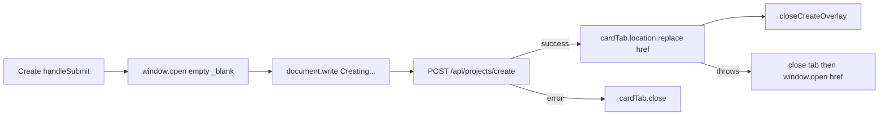

# WF-14: Technical Plan

Implements: FR-PROJECT-001, FR-CREATE-001, FR-SHEET-001, FR-SYNC-001, FR-SYNC-RATES-001, FR-PAYMENT-001
AR references: AR-WEBARCH-001, AR-REACT-001, AR-NEXTJS-001, AR-HTML-001, AR-TYPESCRIPT-001, AR-LINEAGE-001, AR-LINEAGE-002, AR-WRITING-001, AR-WORKSPACE-001, AR-SECRETS-001
Context: [context.md](context.md)

**Workflow:** WF-14-project-card-it-opens-same (large ceremony)
**Repos:** web (`feptm-web`); feptm-server unchanged
**Task:** Cycle 4 — after create, the new tab MUST leave `about:blank` in Chrome and Yandex. Stop `window.open('about:blank')`. Open a same-origin placeholder tab, write a `Creating...` document, then `location.replace` the card href. Close the overlay only after a successful replace. On replace failure close the placeholder and fall back to `window.open`. On create error close the placeholder.
**baseline_policy:** `fix_err` — baseline has 0 ERR, 1 WARN (`.gitignore` missing `.DS_Store`). Do not remediate the existing WARN. Enforce zero new violations in touched files.

## Architecture Overview

Cycles 1–3 already ship the card at `/projects/{drive_folder_id}`, the slash-preserving rewrite, list `Link` `target="_blank"`, heading colors, and command-row `PrimaryButton`. This cycle changes only the create-tab handoff.

Today in Chrome and Yandex:

- `feptm-web/src/features/projects/CreateProjectOverlay.tsx` `handleSubmit` calls `window.open('about:blank', '_blank')`
- `feptm-web/src/features/projects/useCreateProject.ts` `onSuccess` closes the overlay, then calls `cardTab.location.replace(cardHref)`
- The new tab stays on `about:blank` during `POST /api/projects/create` and after the overlay closes

Chromium commits a `about:blank` NavigationEntry for `window.open('about:blank')`. That document is not a same-origin page the opener can reliably `location.replace` after the async POST. `window.open('')` plus `document.write` inherits the opener origin and `location.href` (Chromium special-case URLs). Then `location.replace` to the card path works.

MUST NOT:

- Change `feptm-web/src/features/projects/ProjectNameList.tsx` (list `Link` stays `target="_blank"`)
- Change card heading colors or command-row buttons in `feptm-web/src/features/projects/ProjectCard.tsx`
- Change feptm-server, OpenAPI, proto, or `feptm-web/next.config.ts`
- Call `window.open('about:blank')` anywhere
- Open a sized window (`width` / `height` or other window features on the placeholder)
- Navigate the dashboard tab to the card (`router.push`)
- Implement FR-THEME-001
- Change create copy, validation, busy lock, or error text

## Proto Contracts

No proto. N/A.

## REST API

No new endpoints. No server change.

Unchanged client paths in `feptm-web/src/lib/api/projects.ts`:

- `POST /api/projects/create` — 200 `ProjectMetaResponse`; `drive_folder_id` is required to build the card URL
- `GET /api/projects/{drive_folder_id}/` — card (unchanged)
- `GET /api/projects/` — list invalidate after success (unchanged)

Spec source: FastAPI `/openapi.json`. No OpenAPI YAML file in the repo.

### OpenAPI Schema Changes

No schema changes.

## Database Schema

No migrations.

## Implementation Details

### 1. Placeholder tab — FR-CREATE-001 — `feptm-web/src/features/projects/CreateProjectOverlay.tsx`

In `handleSubmit`, after the empty-name and pending guards, open the tab on the user gesture, then pass that `Window` into `useCreateProject`.

MUST:

- Call `window.open('', '_blank')` with no URL and no features string
- If the returned `Window` is non-null, write a same-origin HTML document immediately:
  - `document.open()`
  - `document.write` a static document whose `<title>` is `Creating...` (same text as the overlay status)
  - `document.close()`
- Pass `{ cardTab, name: trimmedName }` into `createProject.mutate`
- If `window.open` returns `null` (blocked), still run create
- If `document.write` throws, still pass the `Window` and run create

MUST NOT:

- Pass `'about:blank'` as the URL
- Pass a features string (`noopener` returns `null` and blocks later replace; `width`/`height` opens a window)
- Write the project name or any user input into the placeholder document
- Change overlay markup, validation, busy lock, Cancel, backdrop, or error text

Keep `CreateProjectVariables.cardTab: Window | null` in `feptm-web/src/features/projects/useCreateProject.ts`.

### 2. Success and error handoff — FR-CREATE-001 — `feptm-web/src/features/projects/useCreateProject.ts`

Build the card URL with the existing helper `feptm-web/src/features/projects/projectCardHref.ts`. Resolve it with `new URL(href, window.location.origin).href` (AR-NEXTJS-001: no hardcoded host).

`onSuccess` MUST:

1. If `drive_folder_id` is missing: `cardTab?.close()` and return. Do not close the overlay (same as today).
2. If `cardTab` is non-null: `location.replace` the absolute card href. Then `cardTab.opener = null`, then `closeCreateOverlay()`, then `invalidateQueries(['projects'])`.
3. If `location.replace` throws: `cardTab.close()`, then `window.open(href, '_blank', 'noopener,noreferrer')` with no size features, then `closeCreateOverlay()`, then invalidate.
4. If `cardTab` is `null`: `window.open(href, '_blank', 'noopener,noreferrer')` with no size features, then close overlay, then invalidate.

`onError` MUST: `variables.cardTab?.close()`. Overlay stays open with `Failed to create the project. Try again later.`

MUST NOT:

- Close the overlay before `location.replace` succeeds or the fallback `window.open` runs
- Leave a placeholder tab open after create error or after a failed replace
- `router.push` the dashboard tab
- Change `mutationFn` or `createProject` in `feptm-web/src/lib/api/projects.ts`

### Out of scope

- `ProjectNameList.tsx` list `Link`
- `ProjectCard.tsx` heading and command-row buttons
- `ClosePeriodModal.tsx`
- `projectCardHref.ts` path shape
- feptm-server, OpenAPI YAML, proto, `next.config.ts`, API client contracts
- FR-THEME-001
- Remediation of the baseline WARN `.DS_Store`
- A new test runner
- Auth
- User-facing copy

## Security Considerations

- Placeholder `window.open` MUST omit a features string so the opener keeps a live `Window` reference.
- Fallback `window.open` MUST use `noopener,noreferrer` and MUST omit size features.
- After a successful `location.replace`, set `cardTab.opener = null`.
- Placeholder HTML MUST be a static string. DO NOT interpolate the project name (XSS).
- Card href stays a relative same-origin path resolved against `window.location.origin`. DO NOT hardcode a host.
- Browser calls stay same-origin `/api/*`. No secrets. DO NOT log request or response bodies.

## Config Changes

No new env keys. Prefix N/A for web. Keep `NEXT_PUBLIC_API_URL` as the rewrite origin.
