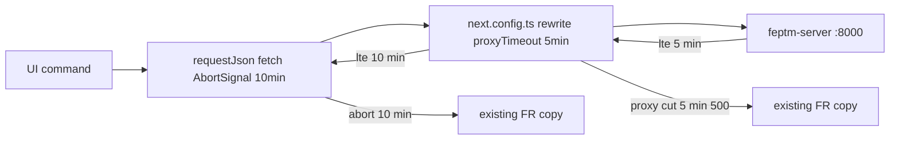

# WF-14: Technical Plan

Implements: FR-CREATE-001, FR-PAYMENT-001, FR-PROJECT-001, FR-SHEET-001, FR-SYNC-001, FR-SYNC-RATES-001
AR references: AR-WEBARCH-001, AR-REACT-001, AR-NEXTJS-001, AR-API-001, AR-HTML-001, AR-TYPESCRIPT-001, AR-FALLBACK-001, AR-LINEAGE-001, AR-LINEAGE-002, AR-WRITING-001, AR-WORKSPACE-001, AR-SECRETS-001
Context: [context.md](context.md)

**Workflow:** WF-14-project-card-it-opens-same (large ceremony)
**Repos:** web (`feptm-web`); feptm-server unchanged
**Task:** Cycle 6 — cut off rewritten `/api/*` proxy waits at 5 minutes (`experimental.proxyTimeout` 300000 ms), not at Next's default 30 seconds. After 10 minutes with no backend response, keep the existing FR error copy. Do not wait forever.
**baseline_policy:** `fix_err` — baseline has 0 ERR, 1 WARN (`.gitignore` missing `.DS_Store`). Do not remediate the existing WARN. Enforce zero new violations in touched files.

## Architecture Overview

Cycles 1–5 already ship the card, slash-preserving rewrites, create-tab handoff, and FR error copy. This cycle changes only wait cutoffs. Long Google Sheets calls (create, Update team, Update rates, Close period) currently die at Next's rewrite proxy default of 30s while FastAPI is still running. The UI then shows the FR failure text too early.

Next.js 15.5.25 (`feptm-web/pnpm-lock.yaml`) passes `experimental.proxyTimeout` into `http-proxy`. Source default is `30_000` ms when the value is missing (`packages/next/src/server/lib/router-utils/proxy-request.ts` in v15.5.25). `proxyTimeout` is global for all external rewrites. The only rewrites in `feptm-web/next.config.ts` are `/api/*`.

Two cutoffs:

- **Proxy (5 min):** `experimental.proxyTimeout: 300_000` so a rewrite to FastAPI MAY wait up to 5 minutes.
- **Client (10 min):** `AbortSignal.timeout(600_000)` on every `fetch` in `feptm-web/src/lib/api/projects.ts`. After 10 minutes with no response, throw `ApiClientError` with the existing FR fallback string. Do not wait forever.

MUST NOT:

- Change rewrite `source` / `destination` rules
- Change feptm-server, uvicorn, or nginx
- Change FR error strings, overlay, card UI, or create-tab handoff
- Add a new env key
- Implement FR-THEME-001
- Remediate the baseline WARN `.DS_Store`

## Proto Contracts

No proto. N/A.

## REST API

No new endpoints. No server change.

Unchanged client paths in `feptm-web/src/lib/api/projects.ts`:

- `GET /api/projects/` — FR-PROJECT-001
- `POST /api/projects/create` — FR-CREATE-001
- `GET /api/projects/{drive_folder_id}/` — FR-PROJECT-001, FR-CREATE-001, FR-SHEET-001
- `POST /api/projects/sync` — FR-SYNC-001
- `POST /api/projects/sync-rates` — FR-SYNC-RATES-001
- `PUT /api/periods` — FR-PAYMENT-001

Spec source: FastAPI `/openapi.json`. No OpenAPI YAML file in the repo.

### OpenAPI Schema Changes

No schema changes.

## Database Schema

No migrations.

## Implementation Details

### 1. Rewrite proxy cutoff — all listed FRs — `feptm-web/next.config.ts`

Add `experimental.proxyTimeout` next to the existing `rewrites()`. Keep `resolveApiOrigin`, `skipTrailingSlashRedirect`, and the four rewrite rules unchanged.

MUST:

- Set `experimental: { proxyTimeout: 300_000 }` (5 minutes, milliseconds)
- Apply to every rewritten `/api/*` request (list, card GET, create, sync, sync-rates, close period) — Next has no per-rule timeout
- Keep `NEXT_PUBLIC_API_URL` as the rewrite origin (AR-NEXTJS-001)

MUST NOT:

- Change rewrite sources or destinations
- Hardcode a host
- Add comments that violate AR-WRITING-001

Restart `next dev` / `next start` after the config change. The setting is not hot-reloaded.

### 2. Client hard cap — all listed FRs — `feptm-web/src/lib/api/projects.ts`

`fetch` has no default timeout. Without a client abort, a hung rewrite can wait past the proxy cut. Cap every `requestJson` call at 10 minutes.

MUST:

- Add `const API_REQUEST_TIMEOUT_MS = 600_000`
- Pass `signal: AbortSignal.timeout(API_REQUEST_TIMEOUT_MS)` into `fetch` inside `requestJson`
- Keep the existing `catch` that throws `new ApiClientError(fallbackMessage, 'network', null)` — abort is a network failure
- Keep the six exported FR strings unchanged:
  - `Failed to load the project list. Refresh the page or try again later.`
  - `Failed to create the project. Try again later.`
  - `Failed to load the project card. Refresh the page or try again later.`
  - `Failed to update the team. Try again later.`
  - `Failed to update rates. Try again later.`
  - `Failed to close the period. Try again later.`
- Keep `This period is already closed.` for HTTP 409

A proxy timeout at 5 minutes returns HTTP 500 (`Internal Server Error` from Next's proxy). `response.ok` is false. Existing `ApiClientError(..., 'api', status)` still uses the same FR string. FR text for "failed request" and "network timeout" is already identical.

MUST NOT:

- Change `@req` on the six exports
- Call `fetch` from React (AR-API-001) — only `requestJson` in `src/lib/api/`
- Retry timed-out calls (React Query `retry: 0` in `feptm-web/src/app/providers.tsx` stays)
- Edit overlay, card, or mutation hooks
- Add a new timeout error string

### Out of scope

- `feptm-web/src/features/projects/CreateProjectOverlay.tsx`
- `feptm-web/src/features/projects/useCreateProject.ts`
- `feptm-web/src/features/projects/ProjectCard.tsx`
- feptm-server, OpenAPI YAML, proto
- nginx / uvicorn timeouts
- FR-THEME-001
- Remediation of the baseline WARN `.DS_Store`
- A new test runner
- Auth
- User-facing copy

## Security Considerations

- Browser calls stay same-origin `/api/*`. No secrets. DO NOT log request or response bodies.
- Rewrite destination still comes from `NEXT_PUBLIC_API_URL`, not a hardcoded host.
- Client abort MUST use `AbortSignal.timeout`. DO NOT invent a custom timer that leaks.

## Config Changes

No new env keys. Prefix N/A for web. Keep `NEXT_PUBLIC_API_URL` as the rewrite origin.

Next.js config only:

- `experimental.proxyTimeout`: `300_000` (was implicit `30_000`)
