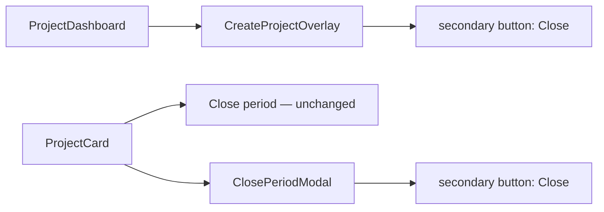

# WF-14: Technical Plan

Implements: FR-CREATE-001, FR-PAYMENT-001, FR-PROJECT-001, FR-SHEET-001, FR-SYNC-001, FR-SYNC-RATES-001
AR references: AR-WEBARCH-001, AR-REACT-001, AR-NEXTJS-001, AR-HTML-001, AR-TYPESCRIPT-001, AR-LINEAGE-002, AR-WRITING-001, AR-WORKSPACE-001, AR-SECRETS-001
Context: [context.md](context.md)

**Workflow:** WF-14-project-card-it-opens-same (large ceremony)
**Repos:** web (`feptm-web`); feptm-server unchanged
**Task:** Cycle 7 — rename the create overlay and Close period modal secondary button label from `Cancel` to `Close`. The `Close period` command on the project card stays unchanged.
**baseline_policy:** `fix_err` — baseline has 0 ERR, 1 WARN (`.gitignore` missing `.DS_Store`). Do not remediate the existing WARN. Enforce zero new violations in touched files.

## Architecture Overview

FR-CREATE-001 v2 and FR-PAYMENT-001 v8 already require the secondary overlay/modal button label `Close`. The web UI still renders `Cancel` in two components. This cycle changes visible button text only.

MUST:

- Change the visible secondary button label to `Close` in `feptm-web/src/features/projects/CreateProjectOverlay.tsx`.
- Change the visible secondary button label to `Close` in `feptm-web/src/features/projects/ClosePeriodModal.tsx`.
- Keep `Close period` on the project card command row in `feptm-web/src/features/projects/ProjectCard.tsx` unchanged.
- Keep button roles and styles: Create/Confirm primary (`.primary-button` / `PrimaryButton`); modal/overlay dismiss secondary (`.secondary-button`).
- Keep existing behavior: dismiss while not busy; disabled while pending; backdrop and Escape rules unchanged.

MUST NOT:

- Rename internal props or handlers (`onCancel`, `handleCancel`, `isCancelDisabled`) — label-only change.
- Change feptm-server, OpenAPI, proto, API client, or `next.config.ts`.
- Change overlay/modal markup, validation, busy lock, backdrop, error copy, or success copy.
- Change the `Close period` primary command on the project card.
- Remediate the baseline WARN `.DS_Store`.
- Edit FR specs — FR-CREATE-001 v2 and FR-PAYMENT-001 v8 already document `Close`.

## Proto Contracts

No proto. N/A.

## REST API

No API changes.

### OpenAPI Schema Changes

No schema changes.

## Database Schema

No migrations.

## Implementation Details

### 1. Create overlay secondary button

| File | Change |
|------|--------|
| `feptm-web/src/features/projects/CreateProjectOverlay.tsx` | Replace button child text `Cancel` with `Close` (lines 108–115). Keep `className="secondary-button"`, `disabled={isBusy}`, and `handleCancel` handler. |

FR-CREATE-001 AC: "Close closes the overlay…", "Create and Close are disabled" while busy, "Create and Close are enabled again" on error.

### 2. Close period modal secondary button

| File | Change |
|------|--------|
| `feptm-web/src/features/projects/ClosePeriodModal.tsx` | Replace button child text `Cancel` with `Close` (lines 125–132). Keep `className="secondary-button"`, `disabled={isCancelDisabled}`, and `handleCancel` handler. |

FR-PAYMENT-001 AC: modal has "Confirm (primary) and Close (secondary) buttons"; "Close before successful closure closes the modal"; after success "Close is enabled".

### 3. Project card command row — no change

| File | Change |
|------|--------|
| `feptm-web/src/features/projects/ProjectCard.tsx` | No edit. `Close period` primary command stays as-is. |

### 4. Tests and docs

No automated tests reference `Cancel` in `feptm-web`. No test file changes required.

## Security Considerations

No security impact. Label-only UI change.

## Config Changes

No config changes.
