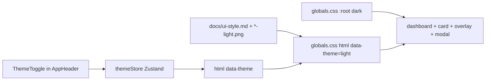

# WF-15: Technical Plan

Implements: FR-THEME-001
AR references: AR-WEBARCH-001, AR-REACT-001, AR-NEXTJS-001, AR-HTML-001, AR-TYPESCRIPT-001, AR-LINEAGE-001, AR-LINEAGE-002, AR-WRITING-001, AR-WORKSPACE-001, AR-SECRETS-001
Context: [context.md](context.md)

**Workflow:** WF-15-toggle-panel-dark-light-theme (minimal ceremony)
**Repos:** web (`feptm-web`); feptm-server unchanged
**Task:** Toggle the panel dark and light theme with one button on the projects dashboard and the project card
**baseline_policy:** `fix_err` — baseline has 0 ERR, 1 WARN (`.gitignore` missing `.DS_Store`). Do not remediate the existing WARN. Enforce zero new violations in touched files.

## Architecture Overview

Theme is client-only. First paint stays dark via existing `:root` tokens in `feptm-web/src/app/globals.css`. A click flips an in-memory Zustand store and sets `data-theme` on `document.documentElement`. Overlay and Close period modal consume the same CSS variables — they inherit, they do not get their own button.



MUST:

- First display of dashboard, card, create overlay, Close period modal = dark. OS `prefers-color-scheme` MUST NOT affect first display.
- Same-tab navigation dashboard ↔ card keeps the chosen theme (Zustand module store).
- Full reload of the dashboard URL = dark again. DO NOT use `localStorage`, cookies, `next-themes`, or persist middleware.
- New browser tab (list `target="_blank"`, create placeholder) = first display = dark.
- Theme button only in the header, top right, on dashboard and card.
- Overlay and modal: no theme button; inherit current tokens.
- While overlay or modal is open: chrome under the dimmer is `inert` so the theme button is not available and a click on the dimmed page does not toggle.
- Cancel and command errors do not touch theme state.

MUST NOT:

- Change feptm-server, OpenAPI, proto, `next.config.ts`, API client, or user-facing copy.
- Invent a third palette or hardcode hex in components.
- Copy landing nav labels, "Start project", marketing copy, or the chat widget.
- Follow OS theme.

## Proto Contracts

No proto. N/A.

## REST API

No API changes. Backend is not involved.

### OpenAPI Schema Changes

No schema changes.

## Database Schema

No migrations.

## Implementation Details

### 1. Token layer — `feptm-web/src/app/globals.css`

Keep the current `:root` block as the dark default (first paint without JS). Add light overrides only on `html[data-theme="light"]`. Update `color-scheme` with the active theme. DO NOT add `@media (prefers-color-scheme)`.

Reuse the same token names (`--background`, `--foreground`, `--muted`, `--accent`, `--on-accent`, `--surface`, `--border`, `--error`, `--overlay`, `--grid`). Components already use `var(--*)`; they flip when the attribute changes.

Implementer MUST sample light values from `feptm-analysis/docs/ui-style.md` and snapshots `header-light.png`, `buttons-light.png`, `cards-light.png`, `heading-light.png`, `footer-light.png`. Confirm against live light CSS on https://foreachpartners.com/ (sampled during implement, not invented). Dark `:root` values stay as they are unless a snapshot mismatch is found.

`--overlay` and form fields: no input snapshot. Derive from the active-theme tokens (background + alpha / surface / border). Same hue family. DO NOT add new token names unless a snapshot requires a value that has no existing role.

Add `.theme-toggle` as an outline control (transparent fill, `1px` `var(--border)`, `var(--foreground)` icon) sized for an icon, top-right in the header. Reuse radius/space tokens. DO NOT reuse landing CTA styles.

Header layout: `.app-header` MUST place brand left and the toggle right (`justify-content: space-between` or `margin-left: auto` on the toggle).

### 2. Theme state — new `feptm-web/src/features/theme/themeStore.ts`

AR-REACT-001: Zustand for theme.

```ts
type Theme = 'dark' | 'light';

interface ThemeState {
  theme: Theme;
  toggleTheme: () => void;
}
```

Default `theme: 'dark'`. `toggleTheme` flips dark ↔ light. No persist. No OS read.

### 3. Apply `data-theme` — new `feptm-web/src/features/theme/ThemeSync.tsx`

Client component. Subscribe to the store. Write `document.documentElement.dataset.theme = theme`. Mount in `feptm-web/src/app/providers.tsx` next to `QueryClientProvider`.

First HTML from `feptm-web/src/app/layout.tsx` has no `data-theme="light"`, so SSR/first paint is dark.

### 4. Theme button — new `feptm-web/src/components/ThemeToggle.tsx`

Named export. `'use client'`. Outline `<button type="button" className="theme-toggle">`.

- Dark theme: sun icon (click applies light).
- Light theme: moon icon (click applies dark). Icons match the outline control on `header-light.png`. Inline SVG, `aria-hidden="true"`.
- Icon-only: MUST have an accessible name (`aria-label` that names the action, e.g. switch to light / switch to dark).
- `// @req FR-THEME-001` on the line above `export function ThemeToggle`.

MUST NOT put text labels from the landing page on the button.

### 5. Header — `feptm-web/src/components/AppHeader.tsx`

Render `ThemeToggle` at the top right. Accept `inert?: boolean` and set it on `<header>` so overlay/modal can lock the chrome. Keep logo + wordmark. No nav items.

### 6. Lock chrome under overlay/modal — AR-HTML-001

Today: `feptm-web/src/features/projects/ProjectCard.tsx` sets `inert` only on `<main>`. Header stays clickable. `feptm-web/src/features/projects/ProjectDashboard.tsx` does not set `inert` at all.

MUST set `inert` on header, main, and footer while the create overlay or Close period modal is open.

- Dashboard: read `isCreateOverlayOpen` from `feptm-web/src/features/projects/projectDashboardStore.ts`; pass into `AppHeader` and set on `main` / `footer`.
- Card: pass `isCloseOpen` the same way.

Overlay/modal stay outside the inert tree. Existing backdrop `stopPropagation` stays. DO NOT add a theme button inside `feptm-web/src/features/projects/CreateProjectOverlay.tsx` or `feptm-web/src/features/projects/ClosePeriodModal.tsx`.

### Out of scope

- feptm-server, OpenAPI, proto, `next.config.ts`, API client contracts
- `public/creating.html`
- Persist across reload or across tabs
- Remediation of the baseline WARN `.DS_Store`
- Tailwind, `next-themes`, a third button style
- Copy or heading text changes

## Security Considerations

- No secrets. No backend. No new env keys.
- Theme icons are inline SVG, not remote URLs (AR-FALLBACK-001).
- DO NOT log request/response bodies (unchanged).
- `inert` on chrome under overlay/modal: no pointer or keyboard access to the theme button while a dialog is open.

## Config Changes

No new env keys. Prefix N/A for web.
