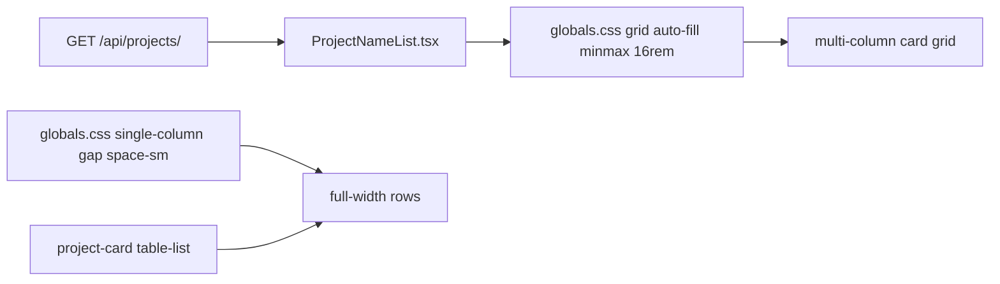

# WF-16: Technical Plan

Implements: FR-PROJECT-001
AR references: AR-WEBARCH-001, AR-HTML-001, AR-LINEAGE-001, AR-LINEAGE-002, AR-WRITING-001, AR-WORKSPACE-001, AR-SECRETS-001
Context: [context.md](context.md)

**Workflow:** WF-16-dashboard-project-names-as-single-column (minimal ceremony)
**Repos:** web (`feptm-web`); feptm-server unchanged
**Task:** Dashboard project names as a single-column vertical list of full-width rows matching the Tables links on the project card, not a multi-column card grid
**baseline_policy:** `fix_err` — baseline has 0 ERR, 1 WARN (`.gitignore` missing `.DS_Store`). Do not remediate the existing WARN. Enforce zero new violations in touched files.

## Architecture Overview

Layout-only change on the existing dashboard at `/`. List fetch, sort, new-tab click, create overlay, and theme tokens stay as they are. Markup in `feptm-web/src/features/projects/ProjectNameList.tsx` already matches Tables (`ul` / `li` / block link). The mismatch is CSS: `.project-name-list` is a multi-column card grid.

Reference (do not change): `feptm-web/src/features/projects/ProjectCardTables.tsx` + `.project-card__table-*` in `feptm-web/src/app/globals.css`.

MUST:

- Project names = single-column vertical list of full-width rows inside `.dashboard` (`width: min(100% - 2rem, 72rem)` — same max width as `.project-card`).
- Each row chrome MUST match a Tables link: `var(--surface)`, `1px solid var(--border)`, `var(--radius)`, left-aligned name.
- Row spacing and link padding MUST match Tables: `gap: var(--space-sm)`, `padding: var(--space-md) var(--space-lg)`.
- Dark and light MUST keep working via existing tokens (`:root` / `html[data-theme="light"]`). DO NOT add a local palette.
- Keep `target="_blank"` + `rel="noopener noreferrer"` on the name link.

MUST NOT:

- Lay out names as `grid-template-columns: repeat(auto-fill, minmax(16rem, 1fr))` or any multi-column card grid from `docs/ui-style/cards.png`.
- Copy marketing landing copy or the chat widget.
- Change feptm-server, OpenAPI, proto, API client, sort, overlay, theme store, or user-facing copy.
- Extract a shared `.list-row` class in this workflow (scope). Keep BEM blocks; align values only.

## Proto Contracts

No proto. N/A.

## REST API

No API changes. Client still uses `GET /api/projects/` via `feptm-web/src/lib/api/projects.ts`.

### OpenAPI Schema Changes

No schema changes.

## Database Schema

No migrations.

## Implementation Details

### Gap vs current `feptm-web`

| Surface | Now (`feptm-web/src/app/globals.css` ~175–200) | MUST become (match Tables ~339–363) |
|---------|-----------------------------------------------|-------------------------------------|
| List | `display: grid; grid-template-columns: repeat(auto-fill, minmax(16rem, 1fr)); gap: var(--space-lg)` | `display: grid; gap: var(--space-sm)` — no `grid-template-columns` (implicit one column, full width) |
| Item chrome | `--surface`, `1px var(--border)`, `--radius` | Unchanged |
| Link padding | `var(--space-xl) var(--space-lg)` | `var(--space-md) var(--space-lg)` |
| Hover | `color: var(--accent)` | Unchanged |

### Files

| File | Change |
|------|--------|
| `feptm-web/src/app/globals.css` | Edit `.project-name-list` and `.project-name-list__link` only. Leave `.project-name-list__item` and `__link:hover` as-is. |
| `feptm-web/src/features/projects/ProjectNameList.tsx` | No change. Keep classes, sort, `Link target="_blank"`. |

DO NOT edit `feptm-web/src/features/projects/ProjectDashboard.tsx`, `feptm-web/src/features/projects/ProjectCardTables.tsx`, API, or any feptm-server file.

`@req` stays on `feptm-web/src/lib/api/projects.ts` (contract boundary). DO NOT add `@req` on CSS.

### Verify

Browser, both themes:

1. Dashboard `/`: names stack in one column, each row full width of the dashboard container.
2. Open a project card in a new tab: Tables rows look the same (fill, border, radius, padding, gap, left-aligned text).
3. Loading / empty / error / Create overlay / new-tab click unchanged.

No UI test runner in `feptm-web`. Backend `test_list_projects_*` unchanged.

### Out of scope

- feptm-server, OpenAPI, proto, `next.config.ts`, API client
- Theme toggle, overlay, create flow, sort algorithm
- Shared list-row abstraction
- Remediation of baseline WARN `.DS_Store`

## Security Considerations

- No secrets. No backend. No new env keys.
- Name links keep `rel="noopener noreferrer"` (existing).
- DO NOT log request/response bodies (unchanged).

## Config Changes

No new env keys. Prefix N/A for web.
