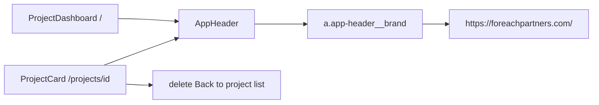

# WF-17: Technical Plan

Implements: FR-PROJECT-001, FR-SHEET-001
AR references: AR-WEBARCH-001, AR-HTML-001, AR-NEXTJS-001, AR-LINEAGE-001, AR-LINEAGE-002, AR-WRITING-001, AR-WORKSPACE-001, AR-SECRETS-001
Context: [context.md](context.md)

**Workflow:** WF-17-remove-back-project-list-project (medium ceremony)
**Repos:** web (`feptm-web`); feptm-server unchanged
**Task:** Remove Back to project list from the project card. Make the ForEach Partners logo and title in the header a link to https://foreachpartners.com/ on the dashboard and the card.
**baseline_policy:** `fix_err` — baseline has 0 ERR, 1 WARN (`.gitignore` missing `.DS_Store`). Do not remediate the existing WARN. Enforce zero new violations in touched files.

## Architecture Overview

One `AppHeader` already renders on the dashboard (`/`) and on the project card (`/projects/{drive_folder_id}`). The company-site link is one header change. The Back control lives only on the card.



MUST:

- Logo (``) and wordmark `ForEach Partners` are **one** link `<a href="https://foreachpartners.com/" target="_blank" rel="noopener noreferrer">` (trailing slash as specified).
- The same header is on the dashboard and the card (both already mount `AppHeader`).
- The card MUST NOT show the text `Back to project list` and MUST NOT navigate to `/`.
- Navigation uses a semantic `<a>` (AR-HTML-001). DO NOT use Next.js `Link` for the external URL.
- New tab: `target="_blank"` and `rel="noopener noreferrer"` (same as project-name and Sheets links).
- Keep `inert` on `AppHeader` while the Create overlay or Close period modal is open: the link is not reachable (AR-HTML-001, FR-PAYMENT-001).
- DO NOT lock the header link while Update team / Update rates / Close period is in progress.
- Colors, styles, size, and placement of the logo and the words `ForEach Partners` MUST stay as they are now. Wrapping in `<a>` MUST NOT shift the brand, change the gap, change the PNG size (32×32), change wordmark typography, change `var(--foreground)`, or change header layout (brand left, ThemeToggle right).

MUST NOT:

- Change colors, styles, size, or placement of the logo and wordmark `ForEach Partners` (including hover/active/visited, underline, scale, padding, margin, font-size, letter-spacing, font-weight).
- Change feptm-server, OpenAPI, proto, or the API client.
- Download or hotlink the logo/CSS from foreachpartners.com.
- Copy marketing copy, nav, or the chat widget.
- Add `@req` on `AppHeader` (not a REST boundary; `@req` stays in `feptm-web/src/lib/api/projects.ts`).
- Remediate the baseline WARN `.DS_Store`.

## Proto Contracts

No proto. N/A.

## REST API

No API changes.

### OpenAPI Schema Changes

No schema changes.

## Database Schema

No migrations.

## Implementation Details

### 1. FR specs

Changelog already exists on FR-SHEET-001 v2 / FR-SYNC-001 v8 / FR-SYNC-RATES-001 v9 / FR-PAYMENT-001 v7. Acceptance criteria still do not forbid Back and do not require the header link.

| File | Change |
|------|--------|
| `feptm-analysis/fr-specs/FR-PROJECT-001.yaml` | Add AC: logo + wordmark are one link to `https://foreachpartners.com/` on the dashboard and the card. Colors, styles, size, and placement of the logo and the words `ForEach Partners` MUST NOT change. revision `v3 (2026-09-06)`. |
| `feptm-analysis/fr-specs/FR-SHEET-001.yaml` | Add AC: the card MUST NOT show `Back to project list` and MUST NOT navigate to the list. The card header is the same link as the dashboard. |

DO NOT edit FR-SYNC-001 / FR-SYNC-RATES-001 / FR-PAYMENT-001: Back is already removed in revision; current ACs do not require Back. FR-PAYMENT-001 "does not navigate to the list" while the modal is open stays valid.

### 2. Header brand link

`feptm-web/src/components/AppHeader.tsx`: replace `div.app-header__brand` with:

```tsx
<a className="app-header__brand" href="https://foreachpartners.com/" rel="noopener noreferrer" target="_blank">
  
  <span className="app-header__wordmark">ForEach Partners</span>
</a>
```

- `alt=""` — decorative image; the accessible name of the link is the wordmark (AR-HTML-001).
- DO NOT add `'use client'`.
- `ThemeToggle` and `inert` stay unchanged.
- `feptm-web/src/features/projects/ProjectDashboard.tsx` and the pages stay unchanged (they already render `AppHeader`).
- Markup inside the brand MUST stay the same: same `src`, `width={32}` `height={32}`, `__logo` / `__wordmark` classes, text `ForEach Partners`.

`feptm-web/src/app/globals.css` `.app-header__brand`: add only `text-decoration: none` (reset the `<a>` default, otherwise an underline appears). All other `__brand`, `__logo`, `__wordmark` properties MUST NOT change: `display`, `align-items`, `gap: 0.75rem`, `color: var(--foreground)`, logo 32×32, `object-fit: contain`, wordmark `font-size` / `font-weight` / `letter-spacing`. DO NOT add hover/active/visited, a local palette, or padding/margin on the brand (AR-WEBARCH-001).

### 3. Remove Back from the card

`feptm-web/src/features/projects/ProjectCard.tsx`:

- Delete the `isCommandBusy ? <button disabled>Back…` / `<Link href="/">Back…` block.
- Delete the unused `import Link from 'next/link'`.
- Commands, statuses, Tables, and `inert` stay unchanged.

`feptm-web/src/app/globals.css`: delete `.project-card__back` and `.project-card__back:disabled`.

### Verify

Browser, dark and light:

1. Dashboard `/`: a click on the logo and on `ForEach Partners` opens `https://foreachpartners.com/` in a new tab. The dashboard stays.
2. Card: the same link; no `Back to project list` text; no navigation to `/` from the header.
3. Create overlay / Close period modal: header is `inert`, the link is not clickable.
4. While a command runs: command buttons are disabled, the header link still works.
5. Dark and light: logo and wordmark match the current header — color, 32×32 size, gap, left position, typography. No underline, no shift, no hover restyle.

No UI test runner in `feptm-web`.

### Out of scope

- feptm-server, OpenAPI, proto, `next.config`, API client
- Theme toggle, overlay, create, sync/rates/close logic
- `docs/ui-style.md`
- baseline WARN `.DS_Store`

## Security Considerations

- No secrets. No backend. No new env keys.
- The external URL is hardcoded in markup (public site, not a secret).
- DO NOT log clicks or URLs.
- `target="_blank"` MUST include `rel="noopener noreferrer"`.

## Config Changes

No new env keys. Prefix N/A for web.
